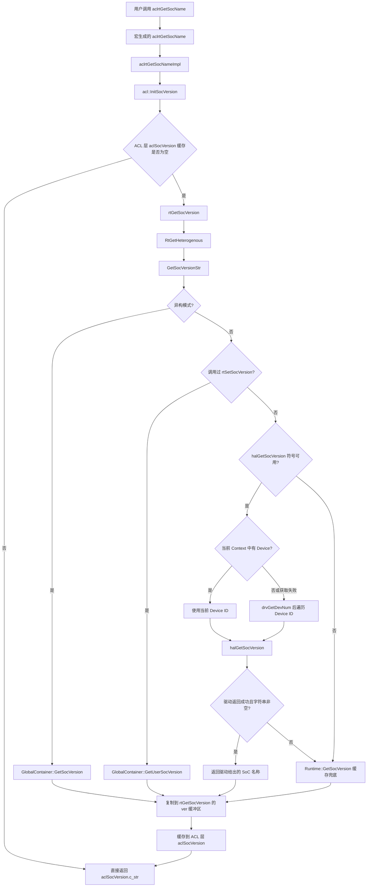

# `aclrtGetSocName` 完整调用链

> 结论先行：常规有设备场景下，SoC 名称优先由 Driver HAL 接口 `halGetSocVersion(deviceId, ...)` 返回。该接口的正式实现不在当前开源仓中；当前仓库只能追到声明和调用点，无法仅凭这些源码确认驱动内部最终读取的是固件、设备信息区还是硬件寄存器。

## 1. 总体调用链



主干可以简写为：

```text
aclrtGetSocName()
  -> aclrtGetSocNameImpl()
  -> acl::InitSocVersion()
  -> rtGetSocVersion()
  -> GetSocVersionStr()
  -> GetSocVersionByDeviceId()
  -> halGetSocVersion(deviceId, ...)
```

## 2. AscendCL 对外接口

### 2.1 接口声明

文件：`runtime/include/external/acl/acl_base_rt.h:369-376`

```cpp
/**
 * @ingroup AscendCL
 * @brief get soc name
 *
 * @retval null for failed
 * @retval OtherValues success
 */
ACL_FUNC_VISIBILITY const char* aclrtGetSocName();
```

### 2.2 对外函数由宏生成

接口登记在：`runtime/src/acl/aclrt_impl/acl_rt_wrapper.h:518`

```cpp
_(const char*, aclrtGetSocName, (), ())
```

转发宏定义在：`runtime/src/acl/aclrt_impl/acl_rt_wrapper.h:17-19`

```cpp
#define ACL_RT_CPP(ret, name, sig, args) \
    ret name sig { return name##Impl args; }
```

宏在 `runtime/src/acl/aclrt/acl_rt.cpp:40` 展开：

```cpp
ACL_RT_FUNC_MAP(ACL_RT_CPP)
```

因此实际生成的入口等价于：

```cpp
const char* aclrtGetSocName()
{
    return aclrtGetSocNameImpl();
}
```

## 3. ACL 实现层与一级缓存

实现位于：`runtime/src/acl/aclrt_impl/acl_rt_impl_base.cpp:189-200`

```cpp
const char* aclrtGetSocNameImpl()
{
    const auto ret = acl::InitSocVersion();
    if (ret != ACL_SUCCESS) {
        return nullptr;
    }
    return aclSocVersion.c_str();
}
```

`acl::InitSocVersion()` 位于同一文件的 `121-135` 行：

```cpp
aclError InitSocVersion()
{
    const std::unique_lock<std::mutex> lk(aclSocVersionMutex);
    if (aclSocVersion.empty()) {
        char_t socVersion[SOC_VERSION_LEN] = {};
        const auto rtErr = rtGetSocVersion(
            socVersion, static_cast<uint32_t>(sizeof(socVersion)));
        if (rtErr != RT_ERROR_NONE) {
            return ACL_GET_ERRCODE_RTS(rtErr);
        }
        aclSocVersion = std::string(socVersion);
    }
    return ACL_SUCCESS;
}
```

缓存变量定义在 `acl_rt_impl_base.cpp:26-29`：

```cpp
namespace {
std::mutex aclSocVersionMutex;
std::string aclSocVersion;
constexpr size_t SOC_VERSION_LEN = 128U;
}
```

这里有三个关键点：

1. `aclSocVersion` 是进程内静态缓存，并通过互斥锁保护首次初始化。
2. 第一次成功获取后，后续 `aclrtGetSocName()` 不再调用 `rtGetSocVersion()`。
3. 返回指针来自 `aclSocVersion.c_str()`，调用者不应释放或修改。由于当前源码中该字符串成功初始化后不再修改，所以指针在正常进程生命周期内保持有效。

> 注意：如果第一次 `aclrtGetSocName()` 已经成功缓存，之后再调用 `rtSetSocVersion()`，当前代码不会主动刷新 ACL 层的 `aclSocVersion`，因此后续 `aclrtGetSocName()` 仍会返回第一次缓存的名称。

## 4. Runtime API：`rtGetSocVersion`

实现位于：`runtime/src/runtime/api/api_c_soc.cc:84-121`

主要步骤：

```cpp
rtError_t rtGetSocVersion(char_t* ver, const uint32_t maxLen)
{
    const Runtime* const rtInstance = Runtime::Instance();
    // 检查 Runtime、ver 和 maxLen

    const int32_t isHetero = RtGetHeterogenous();
    std::string socName = GetSocVersionStr(isHetero);

    if (socName.empty()) {
        // 写入 "UnknowSocType"，但返回 RT_ERROR_INSTANCE_VERSION
    }

    // 将 socName 复制到调用者缓冲区 ver
    return ACL_RT_SUCCESS;
}
```

如果没有获得有效名称，函数会把 `"UnknowSocType"` 写入缓冲区，但仍返回 `RT_ERROR_INSTANCE_VERSION`。上层 `acl::InitSocVersion()` 因此判定失败，不会缓存该字符串，最终 `aclrtGetSocNameImpl()` 返回 `nullptr`。

## 5. `GetSocVersionStr` 的取值优先级

实现位于：`runtime/src/runtime/api/api_c_soc.cc:40-76`。

### 5.1 异构模式

```cpp
if (isHeterogenous == 1) {
    return GlobalContainer::GetSocVersion();
}
```

异构模式直接返回 Runtime 全局容器中的有效 SoC 名称，不在这里查询当前设备。

### 5.2 用户通过 `rtSetSocVersion()` 设置

```cpp
if (rtInstance->GetIsUserSetSocVersion()) {
    return GlobalContainer::GetUserSocVersion();
}
```

`rtSetSocVersion()` 位于 `runtime/src/runtime/api/api_c_soc.cc:124-149`。它先调用 `GetChipTypeFromPlatform()` 校验名称，并检查用户输入是否与已知硬件 SoC 冲突，然后写入：

```text
GlobalContainer::rtChipType
GlobalContainer::userSocVersion
GlobalContainer::socVersion
Runtime::isUserSetSocVersion
```

因此，这一分支返回的是用户指定的目标 SoC，而不一定是本次调用现场重新读取的硬件值。

### 5.3 当前 Context 对应的设备

若 `halGetSocVersion` 符号存在，则优先检查当前 Context：

```cpp
const Context* const curCtx = rtInstance->CurrentContext();
if (curCtx != nullptr) {
    const Device* const device = curCtx->Device_();
    if (device != nullptr) {
        return GetSocVersionByDeviceId(device->Id_());
    }
}
```

真正取得字符串的位置是 `api_c_soc.cc:27-37`：

```cpp
std::string GetSocVersionByDeviceId(const uint32_t devId)
{
    char_t socVersion[SOC_VERSION_LEN] = {0};
    const drvError_t drvRet =
        halGetSocVersion(devId, socVersion, SOC_VERSION_LEN);

    const std::string socVer(
        socVersion, strnlen(socVersion, SOC_VERSION_LEN));
    if ((drvRet == DRV_ERROR_NONE) && (!socVer.empty())) {
        return socVer;
    }
    return "";
}
```

这就是常规路径中 `Ascend910B1`、`Ascend950` 等名称进入 Runtime 的直接位置。

### 5.4 没有当前设备或当前设备查询失败

Runtime 调用：

```cpp
uint32_t deviceCnt = 1U;
drvGetDevNum(&deviceCnt);
for (uint32_t i = 0U; i < deviceCnt; i++) {
    const std::string socVersion = GetSocVersionByDeviceId(i);
    if (!socVersion.empty()) {
        return socVersion;
    }
}
```

即遍历逻辑 Device ID，返回第一个由 `halGetSocVersion()` 成功取得的非空名称。

### 5.5 Driver HAL 路径不可用或全部失败

最终退回：

```cpp
return rtInstance->GetSocVersion();
```

`Runtime::GetSocVersion()` 位于 `runtime/src/runtime/core/src/runtime.cc:408-414`：

```cpp
std::string Runtime::GetSocVersion() const
{
    if (!GlobalContainer::GetSocVersion().empty()) {
        return GlobalContainer::GetSocVersion();
    }
    return socVersion_;
}
```

它优先返回全局缓存，否则返回 `Runtime::socVersion_` 成员。

## 6. Runtime 缓存最初如何生成

Runtime 初始化阶段的链路为：

```text
Runtime::InitChipTypeAndSocVersion()
  -> Runtime::InitSocVersion()
  -> Runtime::InitSocVersionAndChipType(workingDev_)
       -> Runtime::InitSocVersionByDrvSocVersion()
       -> 若 Driver 不支持或返回空：
          Runtime::InitSocVersionByHardwareVersion()
            -> halGetDeviceInfo(... INFO_TYPE_VERSION ...)
            -> GetSocVersionByHardwareVer(...)
```

### 6.1 初始化时仍然优先使用 `halGetSocVersion`

`runtime/src/runtime/core/src/runtime.cc:891-934`：

```cpp
char_t socVersion[SOC_VERSION_LEN] = {0};
drvRet = halGetSocVersion(deviceId, socVersion, SOC_VERSION_LEN);

if ((drvRet == DRV_ERROR_NONE) && (socVersion[0] != '\0')) {
    rtChipType_t chipType = CHIP_END;
    GetChipTypeFromPlatform(socVersion, chipType);
    chipType_ = chipType;
    socVersion_ = socVersion;
}
```

驱动返回名称后，Runtime 还会通过 `GetChipTypeFromPlatform()` 将字符串解析成内部 `rtChipType_t`。

### 6.2 `halGetSocVersion` 不支持时的旧式兜底

若 `halGetSocVersion()` 符号不存在、返回 `DRV_ERROR_NOT_SUPPORT`，或者返回空字符串，则执行 `Runtime::InitSocVersionByHardwareVersion()`，位置为 `runtime.cc:937-978`。

其数据仍来自驱动，但读取的是硬件版本数值和 AI Core 信息：

```cpp
halGetDeviceInfo(
    deviceId, MODULE_TYPE_SYSTEM, INFO_TYPE_VERSION, &hardwareVersion);

halGetDeviceInfo(
    workingDev_, MODULE_TYPE_AICORE, INFO_TYPE_CORE_NUM, &vmAicoreNum);

GetSocVersionByHardwareVer(
    hardwareVersion, aicoreNumLevel, vmAicoreNum);
```

`GetSocVersionByHardwareVer()` 位于 `runtime.cc:838-888`，根据 `chipType_`、硬件版本、AI Core 档位和虚拟机场景映射为字符串。例如不同分支会生成 `Ascend910B1`、`Ascend310B1`、`Ascend310P3` 等名称。

因此兜底路径不是从配置文件直接读取一个 `socVersion` 字符串，而是从驱动取得硬件属性后，由 Runtime 代码映射出名称。

## 7. Driver HAL 边界

`halGetSocVersion` 的声明位于：

`runtime/pkg_inc/driver/ascend_hal_base.h:1054-1063`

```cpp
/**
 * @brief Get Soc Version
 * @param [in]  devId       Device ID
 * @param [out] socVersion  soc version
 * @param [in]  len         soc version length
 */
drvError_t halGetSocVersion(
    uint32_t devId, char* socVersion, uint32_t len);
```

Runtime 侧还将它声明为弱符号：`runtime/src/runtime/core/inc/runtime.hpp:31`

```cpp
drvError_t __attribute__((weak)) halGetSocVersion(
    uint32_t devId, char_t* socVersion, uint32_t len);
```

当前仓库搜索到的函数体均为单元测试 Stub；未包含生产环境 Driver HAL 的正式实现。因此源码可确认到的边界是：

```text
CANN ACL/Runtime
  -> halGetSocVersion(logicDeviceId, outputBuffer, length)
  -> Driver HAL（正式实现位于外部驱动组件）
```

不能仅凭当前仓库进一步断言 Driver HAL 内部具体从哪一个寄存器、固件结构或 NVM 区域取得字符串；要继续确认，需要对应版本的 Driver HAL 源码，或者对安装环境中的驱动动态库和内核驱动调用进行符号/日志跟踪。

## 8. 返回值与失败传播

| 层级 | 成功结果 | 失败结果 |
|---|---|---|
| `halGetSocVersion` | 输出非空 SoC 字符串，返回 `DRV_ERROR_NONE` | 返回 Driver 错误或空字符串 |
| `GetSocVersionByDeviceId` | 返回 `std::string` | 返回空字符串 |
| `GetSocVersionStr` | 返回用户值、HAL 值或 Runtime 缓存 | 所有来源都为空时返回空字符串 |
| `rtGetSocVersion` | 复制名称到 `ver`，返回 `ACL_RT_SUCCESS` | 写入 `UnknowSocType`，返回 `RT_ERROR_INSTANCE_VERSION`；复制失败则返回 `RT_ERROR_SEC_HANDLE` |
| `acl::InitSocVersion` | 写入 ACL 静态缓存 | 将 Runtime 错误转换成 ACL 错误 |
| `aclrtGetSocNameImpl` | 返回 `aclSocVersion.c_str()` | 返回 `nullptr` |

## 9. 最终结论

`aclrtGetSocName()` 自身不识别芯片，也不直接读配置或寄存器。它只是返回 ACL 层缓存；缓存首次通过 `rtGetSocVersion()` 建立。

在普通、有设备且用户没有手工指定 SoC 的场景中，真实来源是：

```text
当前设备或遍历到的设备
  -> Driver HAL: halGetSocVersion(deviceId, ...)
  -> Runtime
  -> ACL 静态缓存
  -> aclrtGetSocName() 返回 const char*
```

只有在 Driver HAL 名称接口不可用或失败时，Runtime 才使用已初始化缓存；该缓存初始化时仍优先调用 `halGetSocVersion()`，再不行才通过 `halGetDeviceInfo(INFO_TYPE_VERSION)` 等硬件属性映射出 SoC 名称。
