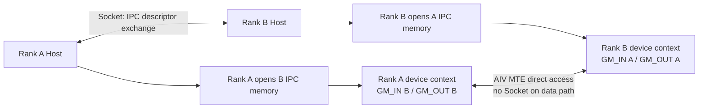
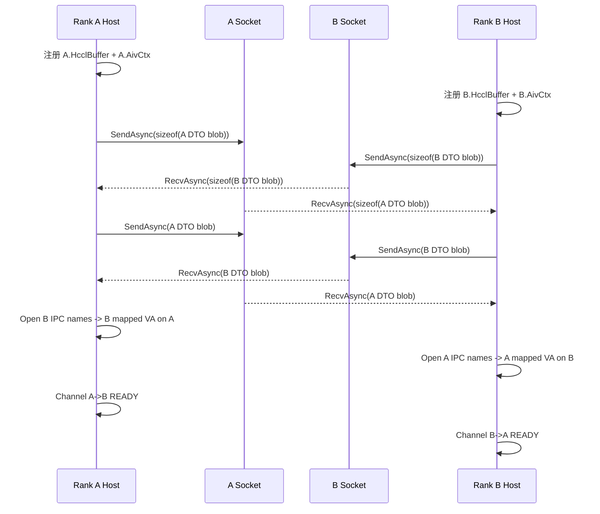

# AIV 直驱 UB.MEM 建链与数据面（MC2）

## 1. 结论先行

AIV 直驱 `UB.MEM` 的核心不是让 Device Kernel 在运行时操作 Socket，而是：

1. **Host 控制面**在 `HcclChannelAcquire -> MyRank::CreateChannels` 阶段建立 Rank A/B 通道，利用 Socket 双向交换本端 Device 内存的 IPC 描述信息。
2. 每个 Rank 将对端 IPC 描述打开成本进程/本 Device 可使用的远端映射地址，并缓存在 Channel 中。
3. `HcclChannelGetHcclBuffer` 只是从已建好的 Channel 中查询 tag 为 `HcclBuffer` 的对端映射；它不再建链，也不传输业务数据。
4. Host 把各 Rank 的远端地址整理成指针表并拷到 Device Context。AIV Kernel 只读地址表，用 MTE 执行 `GM -> UB -> 远端 GM` 搬运，再通过远端 flag 区完成软同步。

> **名称边界**：`COMM_PROTOCOL_UB_MEM` 是 Channel 协议名。稳态共享对象是已做 IPC 映射的 Device GM/HCCL Buffer；AIV 在数据搬运中使用片上 UB 作为中转，不是通过 Socket 搬运数据。

## 2. 整体分层

| 层次 | 运行位置 | 职责 | 关键对象 |
| --- | --- | --- | --- |
| 控制面 | Host | 查拓扑、创建 Channel、交换 IPC 描述、打开远端映射、生成 Rank 地址表 | `HcclChannelDesc`、`ChannelHandle`、Socket、`RemoteIpcRmaBuffer` |
| Context 交接 | Host -> Device | 把各 Rank 的 HCCL Buffer 和同步区地址表拷到 Device | `buffersIn[]`、`buffersOut[]`、`buffIn` |
| 数据面 | AIV Device Kernel | 从本/远端 GM 读写数据，读写 flag 完成 Rank 间同步 | `GM_IN[]`、`GM_OUT[]`、UB Queue、MTE |



## 3. 控制面：`CreateChannels` 创建 Rank 映射

### 3.1 算子侧准备 Channel 请求

AllGather AIV 示例展示了一条完整的使用链：

1. Host 通过 `HcclRankGraphGetLayers/GetLinks` 为每个 `remoteRank` 选择 `COMM_PROTOCOL_UB_MEM` 链路。
2. 组装 `HcclChannelDesc`，其中 `remoteRank` 决定这个 Channel 要查询哪个 Rank 的远端内存。
3. 将 AIV 软同步/Context 内存通过 `HcclCommMemReg` 注册，把得到的 `memHandle` 放入 Channel 描述。
4. 调用 `HcclChannelAcquire(..., COMM_ENGINE_AIV, ...)`。

源码入口：

- `hccl/examples/05_custom_ops_allgather/op_host/all_gather.cc:26-63`：创建并注册 AIV Context 内存。
- `hccl/examples/05_custom_ops_allgather/op_host/all_gather.cc:69-111`：按 `remoteRank` 查找 `UB_MEM` 链路。
- `hccl/examples/05_custom_ops_allgather/op_host/all_gather.cc:114-130`：以 AIV Engine 批量创建 Channel。

### 3.2 `HcclChannelAcquire -> MyRank::CreateChannels`

A5 Communicator V2 路径中，`HcclChannelAcquire` 调用 `MyRank::CreateChannels`：

```text
HcclChannelAcquire
  -> ProcessHcclResPackReq
  -> MyRank::CreateChannels
       -> BatchCreateSockets
       -> BatchCreateChannels
       -> BatchConnectChannels
       -> BatchExchangeAndCheckConsistency
       -> 返回 ChannelHandle
```

对应源码：

- `hcomm/src/coll_communicator_mgr/api_c_adpt/coll_comm_res_c_adpt.cc:640-711`
- `hcomm/src/coll_communicator_mgr/resource_mgr/local/my_rank/my_rank.cc:908-1003`

`CreateChannels` 中的重要步骤如下。

#### a. 组装要交换的内存列表

`CommMems::GetTagMemoryHandles` 总是先放入通信域 HCCL Buffer，其 tag 固定为 `HcclBuffer`，再追加算子注册的 AIV Context/flag 内存：

```text
index 0: HcclBuffer
index 1..N: channelDesc.memHandles 对应的算子内存
```

这个顺序解释了为什么示例中：

- `HcclChannelGetHcclBuffer` 取到对端 HCCL Buffer；
- `HcclChannelGetRemoteMems(...)[memNum - 1]` 取到对端 AIV Context/flag Buffer。

源码：`hcomm/src/coll_communicator_mgr/resource_mgr/local/my_rank/comm_mems/comm_mems.cc:193-218`。

#### b. 注册为 IPC RMA Buffer

`MyRank::BatchCreateChannels` 将上述内存通过 `EndpointMgr::RegisterMemory` 注册到 `UbMemEndpoint`。`UbMemRegedMemMgr` 将其封装为 `LocalIpcRmaBuffer`。

`LocalIpcRmaBuffer` 会：

- 对原始 Device 内存执行页对齐；
- 创建 IPC memory name；
- 保留 `ipcPtr` / `ipcSize` / `ipcOffset`；
- 在交换 DTO 中带上 `addr` / `size` / `offset` / `pid` / `name` / `memInfo(tag)`。

源码：

- `hcomm/src/coll_communicator_mgr/resource_mgr/local/my_rank/my_rank.cc:692-711`
- `hcomm/src/base_comm/resources/reged_mems/ub_mem.cc:16-31`
- `hcomm/src/legacy/ascend950/unified_platform/resource/buffer/local_ipc_rma_buffer.cc:18-56`
- `hcomm/src/legacy/ascend950/unified_platform/resource/buffer/exchange_ipc_buffer_dto.h:21-53`

#### c. Socket 交换 IPC 描述

`AivUbMemTransport` 不通过 Socket 传输业务 Tensor，只交换内存描述。其状态机为：

```text
INIT
  -> SOCKET_OK
  -> SEND_DATA_SIZE
  -> RECV_DATA_SIZE
  -> SEND_MEM_INFO
  -> RECV_MEM_INFO
  -> RECV_MEM_FIN
  -> READY
```

双方都按“先发描述长度、再收长度、再发描述、再收描述”推进异步 Socket 状态机。`BatchConnectChannels` 持续轮询，直到全部 Channel 进入 `READY` 或失败/超时。

源码：

- `hcomm/src/base_comm/resources/endpoint_pairs/channels/aiv/aiv_ub_mem_transport.cc:85-149`
- `hcomm/src/base_comm/resources/endpoint_pairs/channels/aiv/aiv_ub_mem_transport.cc:152-224`
- `hcomm/src/coll_communicator_mgr/resource_mgr/local/my_rank/my_rank.cc:817-888`

#### d. 打开对端内存，形成本 Rank 的远端 VA

收到对端 DTO 后，`RmtBufferUnpackProc` 为每块对端内存创建 `RemoteIpcRmaBuffer`：

- 同进程：无需 `IpcOpenMemory`，使用 `ipcAddr + ipcOffset`；
- 跨进程：调用 `HrtIpcOpenMemory(ipcName)`，得到本进程映射基址，最终地址为 `ipcPtr + ipcOffset`。

因此，Rank A 查到的 Rank B Buffer 地址是 **B 的内存在 A 地址空间中的可访问映射 VA**，不应将它理解为必然等于 B 进程中的原始 VA。

源码：

- `hcomm/src/base_comm/resources/endpoint_pairs/channels/aiv/aiv_ub_mem_transport.cc:227-250`
- `hcomm/src/legacy/ascend950/unified_platform/resource/buffer/remote_rma_buffer.cc:19-41`

## 4. Rank A / Rank B 建链时序



映射结果可概括为：

| 查询位置 | Channel 的 `remoteRank` | `HcclChannelGetHcclBuffer` 返回 |
| --- | --- | --- |
| Rank A | Rank B | B.HcclBuffer 在 A 侧的映射 VA + B Buffer size |
| Rank B | Rank A | A.HcclBuffer 在 B 侧的映射 VA + A Buffer size |

建链是对称的：A 和 B 都同时发送本端描述并接收对端描述。

## 5. `HcclChannelGetHcclBuffer` 查询到底返回什么

V2 路径的实际调用链是：

```text
HcclChannelGetHcclBuffer(comm, channel, &buffer, &size)
  -> MyRank::ChannelGetHcclBuffer
  -> HcommChannelGetRemoteMems
  -> AivUbMemChannel::GetRemoteMems
  -> AivUbMemTransport::GetRemoteMems
  -> GetRemoteUserMems
  -> 遍历 memTags，命中 "HcclBuffer"
```

`GetRemoteUserMems` 把 `RemoteIpcRmaBuffer` 转换为 `CommMem { type, addr, size }`，并连同 `memInfo` 字符串一起缓存。`MyRank::ChannelGetHcclBuffer` 遍历该列表，命中 `memTags[i] == "HcclBuffer"` 后返回。

源码：

- `hcomm/src/coll_communicator_mgr/api_c_adpt/resource/channel_c_adpt.cc:80-124`
- `hcomm/src/coll_communicator_mgr/resource_mgr/local/my_rank/my_rank.cc:1011-1041`
- `hcomm/src/legacy/ascend950/unified_platform/resource/mem/user_remote_mem_getter.h:75-118`

关键语义：

- `channel` 必须已达到 `READY`，否则远端内存表可能尚未建立。
- 返回的 `buffer` 是对端 HCCL Buffer 在本端的映射地址。
- 返回的 `size` 来自对端交换的 HCCL Buffer 描述。
- 返回指针只是借用 Channel 内部缓存；调用者不得释放该地址，Channel/通信域销毁后不得继续使用。

## 6. Socket 的“借还”和所有权

### 6.1 UB.MEM 路径的实际语义

`MyRank::CreateChannels` 在 Host 上为每个 Rank Pair 获取连接好的 Socket，并把裸指针放入 `HcommChannelDesc.socket`。`AivUbMemTransport` 持有该指针，在 Channel 进入 `READY` 前用于交换 IPC 描述。

`MyRank::CreateChannels` 中的“借用 `hcommDescs.socket`”注释，特指在 Channel 建立后，再借该 Socket 完成通信域一致性校验数据交换。这不表示 Socket 所有权转移给一致性校验模块。

源码：

- `hcomm/src/coll_communicator_mgr/resource_mgr/local/my_rank/my_rank.cc:521-579`：创建/获取 Socket 并放入 `HcommChannelDesc`。
- `hcomm/src/coll_communicator_mgr/resource_mgr/local/my_rank/my_rank.cc:934-948`：建 Channel 后借 Socket 执行一致性交换。
- `hcomm/src/base_comm/resources/endpoint_pairs/channels/aiv/aiv_ub_mem_transport.h:38-53`：Transport 只保存 Socket 裸指针。

### 6.2 不要与通用 `SocketMgr::GetSocket/PutSocket` 混淆

通用 Base Comm `SocketMgr` 存在明确的借还状态：

- `GetSocket` 等待 `socketInUseMap_[socket] == false`，然后置 `true`；
- `PutSocket` 置回 `false`，唤醒等待者，并将借用方的裸指针置空。

源码：`hcomm/src/base_comm/resources/endpoint_pairs/sockets/socket_mgr.cc:202-240,269-280`。

但当前 AIV `UB_MEM` 路径是通过 `EndpointPair` 内的兼容 Socket Manager 获取 Socket，`AivUbMemChannel`/`AivUbMemTransport` 本身没有对称调用上述 `PutSocket`。所以对这条路径更准确的说法是：

> Channel/Transport **借用 Socket 指针**执行控制面交换，Socket 仍由 `EndpointPair` 侧 Socket Manager 管理生命周期；不是 Channel 独占所有后再通过 `PutSocket` 归还。

### 6.3 释放时序

- `EndpointPair` 析构时先销毁其记录的 Channel。
- `RemoteIpcRmaBuffer` 析构时对已打开的 IPC memory 执行 `HrtIpcCloseMemory`。
- `MyRank` 析构明确先释放 `rankPairMgr_`（内部销毁 Channel），再释放 `endpointMgr_`。

这个顺序保证远端映射和 Channel 不会比其依赖的管理对象更晚销毁。

## 7. 数据面：Host 与 Device 如何衔接

### 7.1 Host 整理 Rank 地址表

AllGather 示例中，Host 创建两组表：

```text
buffersIn[rank]  = 该 rank 的 HCCL Buffer 地址
buffersOut[rank] = 该 rank 的 AIV Context/flag Buffer 地址
```

本 Rank 使用 `HcclGetHcclBuffer` 和本端 AIV Context；其他 Rank 使用 `HcclChannelGetHcclBuffer` 和 `HcclChannelGetRemoteMems`。Host 最后用 `aclrtMemcpy(..., ACL_MEMCPY_HOST_TO_DEVICE)` 把两组指针写入 Device 上的 AIV Context。

源码：`hccl/examples/05_custom_ops_allgather/op_host/all_gather.cc:133-187`。

### 7.2 Device 解析地址表

AIV Kernel 接收 `buffIn` 后，`InitBuffArray` 将 Device Context 中的指针读入：

```cpp
GM_IN[i]  = addressTableIn[i];
GM_OUT[i] = addressTableOut[i] + FLAG_ADDR_OFFSET;
```

其中：

- `GM_IN[i]` 指向 Rank `i` 的 HCCL Buffer；
- `GM_OUT[i]` 指向 Rank `i` 的 AIV flag 区；
- Kernel 不持有 `ChannelHandle`，更不持有 Socket。

源码：`hccl/examples/05_custom_ops_allgather/inc/aiv_communication_base_v2.h:144-157`。

### 7.3 AIV 直驱数据搬运

AllGather 示例的数据面分两步：

1. 每个 Rank 把本端算子输入拷到自己的 `GM_IN[rank_]`，然后在 flag 区 Record 就绪标记。
2. 每个 AIV 对各 Rank 执行 `WaitFlag`，就绪后从 `GM_IN[remoteRank]` 读数据并写入本端算子输出。

`CpGM2GM` 实际将大块数据分片，每片执行：

```text
remote/local GM -> AIV UB LocalTensor -> destination GM
```

底层分别使用 `copy_gm_to_ubuf_align_v2` 和 `copy_ubuf_to_gm_align_v2`。这就是“AIV 直驱”：数据面由 AIV/MTE 直接访问控制面预先建好的远端映射。

源码：

- `hccl/examples/05_custom_ops_allgather/inc/aiv_all_gather_mesh_1d.h:40-63`
- `hccl/examples/05_custom_ops_allgather/inc/aiv_communication_base_v2.h:334-377`

### 7.4 软同步

`Record(targetRank, ...)` 将 tag 通过 UB -> GM 写到目标 Rank 的 flag 区；`WaitFlag(targetRank, ...)` 通过 GM -> UB 反复读取指定 Rank 的 flag，直到匹配当前 tag。

这是 AIV 算法实现的 Rank 间软同步，与 Socket 控制面的建链握手是两个独立阶段。

源码：`hccl/examples/05_custom_ops_allgather/inc/aiv_communication_base_v2.h:233-251`。

## 8. 关键边界与排查要点

| 现象 | 优先检查 | 原因 |
| --- | --- | --- |
| `HcclChannelAcquire` 超时 | Socket 连接状态、双端 Channel 数量/顺序、DTO 收发状态 | Channel 必须完成双向描述交换才能 `READY` |
| `HcclBuffer not found` | 本端 `GetTagMemoryHandles` 是否带 `HcclBuffer`，对端 DTO 是否解析完成 | 查询依赖 `memInfo == "HcclBuffer"` |
| 远端地址与对端日志原始 VA 不同 | 进程是否不同，`HrtIpcOpenMemory` 返回映射基址是否不同 | 跨进程 IPC 映射 VA 无需与远端原始 VA 相同 |
| Kernel 读写异常 | Host 指针表的 Rank 下标、Context offset、Channel 生命周期 | Device 只相信 Host 预填的 VA |
| 同步卡住 | `GM_OUT[rank]` 的 flag offset、tag 滚动、Record/Wait 目标 Rank | 数据地址正确不代表软同步地址和协议正确 |
| 销毁后偶发非法访问 | 是否保存并重用了 Channel 返回的远端 VA | 远端 VA 所有权属于 Channel/通信域 |

## 9. 一句话总结

**Host 用 Socket 交换“如何访问对端 Device 内存”的描述并建立 Rank->VA 映射；Device AIV 只消费这些 VA，用 MTE 经 UB 中转直接读写远端 GM。**

## 10. 验证边界

本文结论来自当前 checkout 的静态源码跟踪和官方示例对照；未在 Ascend 950 环境执行多 Rank 建链、IPC 映射或 AIV Kernel 运行验证。
