# `moe_distribute_dispatch_v2_full_mesh.h` 源码走读

本文分析 `moe_distribute_dispatch_v2_full_mesh.h` 的一个固定源码版本，只沿 `__NPU_ARCH__ == 3510` 路径展开。文中的“源码”均指该版本；A3 分支仅在需要说明“3510 不会执行什么”时出现。

本文不使用伪代码。代码框均摘自真实代码；较长函数按连续或相关语句分段引用，排版折行不改变表达式和控制流。每逢函数读写 GM、通信 Window、Workspace 或 UB，紧随其后的 SVG 描述实际访问区域；图中方格表达逻辑布局，不代表物理地址连续性之外的额外实现。

文末第 7、8 节补充接口 Tensor、512 B 通信块、共享专家 Rank、显式发送/隐式接收模型，以及 `Copy`、`DataCopy`、`DataCopyPad` 的数据排布。它们整合自原来的两份“路径实现说明补充”，用于消除只沿主调用链阅读时容易产生的概念混淆。

## 0. 先看整体：两条前置支路，一次本地连续化

`Process()` 是全文件的主调用入口：

```cpp
if ASCEND_IS_AIV {
    if (aivId_ < aivUsedAllToAll_) {
        AllToAllDispatch();
    } else {
        CalCumSum();
    }
    PipeBarrier<PIPE_ALL>();
    HXTimeIt(2);
    LocalWindowCopy();
    HXTimeIt(5);
    AscendC::SyncAll<true>();
}
```

前 `aivUsedAllToAll_` 个 AIV 发送 Token payload，后 `aivUsedCumSum_` 个 AIV 交换 count 并生成前缀和。两组核并行执行。随后每个 AIV 都进入 `LocalWindowCopy()`，等待自己需要的前缀和完成，再把各来源 Rank 的稀疏接收槽位整理成连续输出。

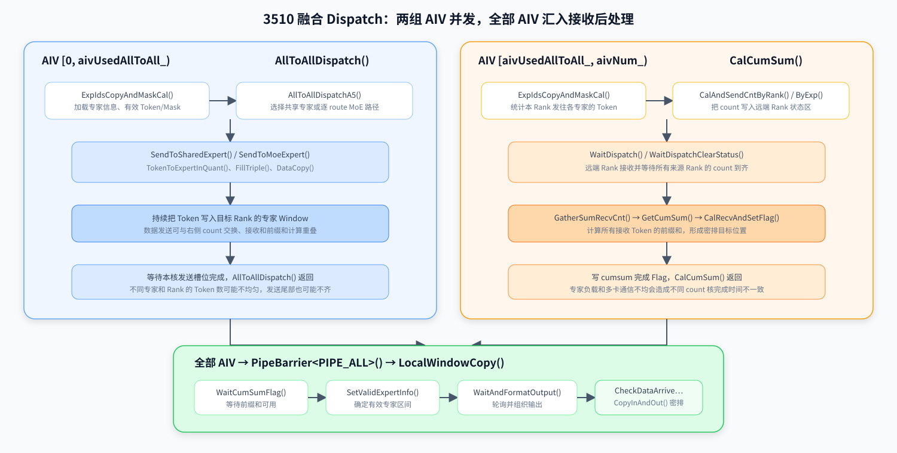

这里有两个不同的“到达”：

- 状态块的 `flag == 1`：本来源 Rank 的 `tokenCnt` 已经写到，`CalCumSum()` 可以计算前缀和；
- payload 中每个 512 B 分块末尾的 `flag == 1.0f`：该 Token 的所有 payload 分块已经写到，`LocalWindowCopy()` 才能搬运。

前者不能替代后者。

## 1. 初始化

### 1.0 `Init()`：绑定输入、输出、Window 与 Workspace

`Init()` 先记录时间点并在 3510 上关闭浮点溢出饱和模式，然后绑定所有 GM Tensor：

```cpp
AscendC::SetCtrlSpr<FLOAT_OVERFLOW_MODE_CTRL, FLOAT_OVERFLOW_MODE_CTRL>(0);
tpipe_ = pipe;
tpipe_->InitBuffer(calBeginBuf_, UB_ALIGN);
aivId_ = GetBlockIdx();
totalWinSize_ = static_cast<uint64_t>(tilingData->moeDistributeDispatchV2Info.totalWinSizeEp);
ctx_.InitAndCheck(mc2Context, tilingData->moeDistributeDispatchV2Info.epWorldSize,
                  totalWinSize_, tpipe_, expandXOut);
xGMTensor_.SetGlobalBuffer((__gm__ XInType *)x);
xActiveMaskGMTensor_.SetGlobalBuffer((__gm__ bool *)xActiveMask);
expertIdsGMTensor_.SetGlobalBuffer((__gm__ int32_t *)expertIds);
dynamicScalesOutGMTensor_.SetGlobalBuffer((__gm__ uint8_t *)dynamicScalesOut);
expertTokenNumsOutGMTensor_.SetGlobalBuffer((__gm__ int64_t *)expertTokenNumsOut);
expandIdxGMTensor_.SetGlobalBuffer((__gm__ int32_t *)expandIdxOut);
elasticInfoGMTensor_.SetGlobalBuffer((__gm__ int32_t *)elasticInfo);
scalesGMTensor_.SetGlobalBuffer((__gm__ float *)scales);
SetTilingDataAndCal(tilingData);
if (hasExpertScalesFlag_) {
    expertScalesGMTensor_.SetGlobalBuffer((__gm__ float *)expertScales);
    expandScalesOutGM_ = expandScalesOut;
}
if (isPerformanceFlag_) {
    performanceInfoGMTensor_.SetGlobalBuffer((__gm__ int32_t *)performanceInfo);
}
SetDataStatus();
expandXOutGM_ = expandXOut;
sendCountsOutGM_ = sendCountsOut;
recvCntWorkspaceGM_ = AscendC::GetUserWorkspace(workspaceGM);
statusSpaceGM_ = GetWindStateAddrByRankId(epRankIdOriginal_);
windowInstatusFp32Tensor_.SetGlobalBuffer((__gm__ float *)statusSpaceGM_);
selfRankWinInGMTensor_.SetGlobalBuffer((__gm__ float *)statusDataSpaceGM_);
```

输入和正式输出的逻辑视图如下。`expertIds` 与可选 `expertScales` 都按展平的 `(token, k)` 排列；`expandIdxOut` 每个输出 Token 保存三个 `int32_t`。

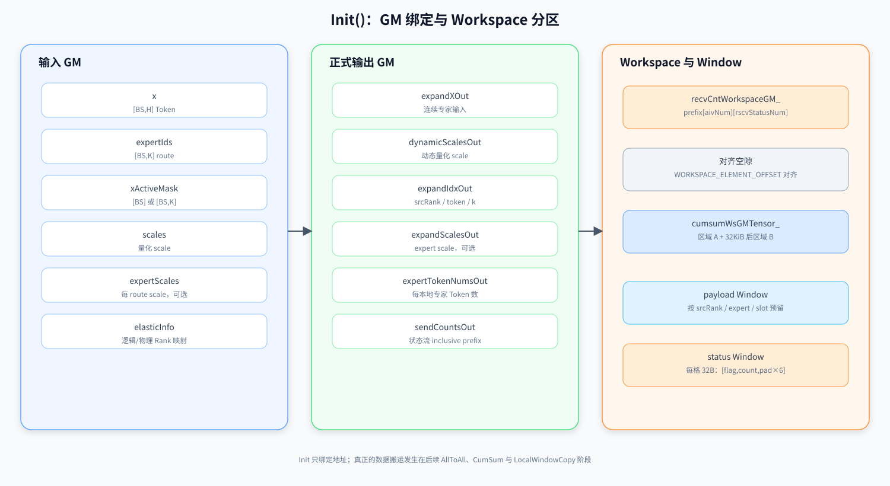

Workspace 被切成两段。第一段保存每个 AIV 都可独立读取的一整行累计 count；第二段从对齐后的 `cumsumWsBaseOffset` 开始，用于两级软同步：

```cpp
uint64_t recvCntWsSize = static_cast<uint64_t>(aivNum_) * rscvStatusNum_ * sizeof(int32_t);
uint64_t cumsumWsBaseOffset =
    Ceil(recvCntWsSize, WORKSPACE_ELEMENT_OFFSET) * WORKSPACE_ELEMENT_OFFSET;
cumsumWsGMTensor_.SetGlobalBuffer(
    (__gm__ float *)((__gm__ uint8_t *)(recvCntWorkspaceGM_) + cumsumWsBaseOffset));
```


### 1.1 `SetTilingDataAndCal()`：推导通信粒度与分核数

`SetTilingDataAndCal()` 首先修正 FP4 的物理元素数，然后调用 `QuantInit()` 获得 `tokenQuantAlign_`、`hOutSizeAlign_` 等量化布局参数。

#### 1.1.1 `SetTilingData()`：读取 tiling 原始字段

被调函数 `SetTilingData()` 不访问输入 Tensor，只从 tiling 读取形状、拓扑、mask/scale 开关和 UB 上限。此前遗漏的关键赋值如下：

```cpp
axisBS_ = tilingData->moeDistributeDispatchV2Info.bs;
axisH_ = tilingData->moeDistributeDispatchV2Info.h;
epWorldSizeOriginal_ = tilingData->moeDistributeDispatchV2Info.epWorldSize;
epRankIdOriginal_ = tilingData->moeDistributeDispatchV2Info.epRankId;
hasElasticInfoFlag_ = tilingData->moeDistributeDispatchV2Info.hasElasticInfo;
hasExpertScalesFlag_ = tilingData->moeDistributeDispatchV2Info.hasExpertScales;
isPerformanceFlag_ = tilingData->moeDistributeDispatchV2Info.isPerformance;
globalBS_ = tilingData->moeDistributeDispatchV2Info.globalBs;
sharedExpertRankNum_ = tilingData->moeDistributeDispatchV2Info.sharedExpertRankNum;
moeExpertNum_ = tilingData->moeDistributeDispatchV2Info.moeExpertNum;
sharedExpertNum_ = tilingData->moeDistributeDispatchV2Info.sharedExpertNum;
zeroComputeExpertNum_ = tilingData->moeDistributeDispatchV2Info.zeroComputeExpertNum;
isTokenMaskFlag_ = tilingData->moeDistributeDispatchV2Info.isTokenMask;
isExpertMaskFlag_ = tilingData->moeDistributeDispatchV2Info.isExpertMask;
axisK_ = tilingData->moeDistributeDispatchV2Info.k;
aivNum_ = tilingData->moeDistributeDispatchV2Info.aivNum;
axisMaxBS_ = globalBS_ / epWorldSizeOriginal_;
maxSize_ = tilingData->moeDistributeDispatchV2Info.maxSizeForUbBuffer;
totalUbSize_ = tilingData->moeDistributeDispatchV2Info.totalUbSize;
```

`epWorldSizeOriginal_ / epRankIdOriginal_` 始终保留 HCCL 原始拓扑；`epWorldSize_ / epRankId_` 才可能在 `InitElasticInfo()` 中被缩容信息覆盖。后续 Window API 同时传入这两套编号，不能混用。

#### 1.1.2 推导 3510 通信布局和分核数

3510 对 FP4 输入/输出先把逻辑 H 换算为实际字节元素数；弹性信息也在这里读入，保证后续专家数和 Rank 数推导使用缩容后的值：

```cpp
copyInAxisH_ = axisH_;
copyOutAxisH_ = axisH_;
if constexpr (Std::IsSame<ExpandXOutType, fp4x2_e2m1_t>::value ||
              Std::IsSame<ExpandXOutType, fp4x2_e1m2_t>::value) {
    copyOutAxisH_ = Ceil(axisH_, FP4_ELEMS_PER_BYTE);
}
if constexpr (Std::IsSame<XType, fp4x2_e2m1_t>::value ||
              Std::IsSame<XType, fp4x2_e1m2_t>::value) {
    copyInAxisH_ = Ceil(axisH_, FP4_ELEMS_PER_BYTE);
}
if (hasElasticInfoFlag_) {
    InitElasticInfo();
}
isShareExpertRankFlag_ = (epRankId_ < sharedExpertRankNum_);
moeExpertRankNum_ = epWorldSize_ - sharedExpertRankNum_;
moeExpertNumPerRank_ = moeExpertNum_ / moeExpertRankNum_;
expertIdsCnt_ = axisBS_ * axisK_;
hOutSize_ = copyOutAxisH_ * sizeof(XOutType);
quantInst_.QuantInit(hAlignSize_, hOutSize_, scaleInBytes_, tokenQuantAlign_,
                     hOutSizeAlign_, scaleOutBytes_, axisH_);
```

3510 的每个通信分块固定为 512 B，其中前 480 B 是有效数据区，末尾 32 B 留作到达标志：

```cpp
hOutSizeAlign_ = tokenQuantAlign_ * sizeof(int32_t) + UB_ALIGN;
blockCntPerToken_ = Ceil(hOutSizeAlign_, SPLIT_BLOCK_DATA_SIZE); // 480 B
hCommuSize_ = blockCntPerToken_ * SPLIT_BLOCK_SIZE;              // 512 B
axisHCommu_ = hCommuSize_ / sizeof(XOutType);
expertPerSizeOnWin_ = axisMaxBS_ * hCommuSize_;
```

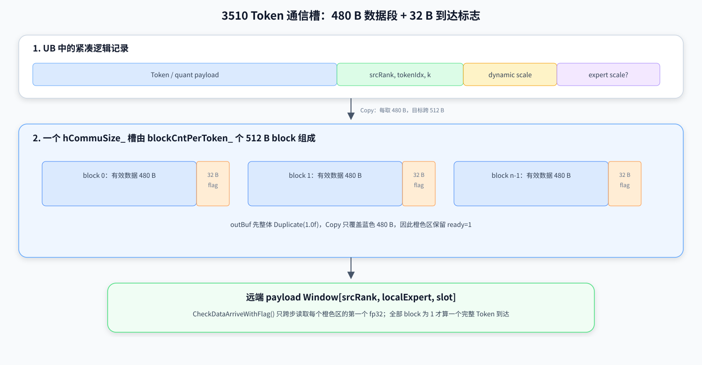

接收状态流数量取决于本 Rank 类型：共享专家 Rank 只接收每个来源 Rank 的一个状态，共 `epWorldSize_` 个；MoE 专家 Rank 为每个本地专家接收每个来源 Rank 的状态，共 `epWorldSize_ * moeExpertNumPerRank_` 个。

```cpp
rscvStatusNum_ = isShareExpertRankFlag_ ? epWorldSize_ :
                  (epWorldSize_ * moeExpertNumPerRank_);
```

3510 按估算的 payload/count 工作量动态划核：

```cpp
aivUsedCumSum_ = aivNum_ - ((axisBS_ * axisK_ * DATA_TO_CNT_TIME_RATIO * aivNum_) /
    (axisBS_ * axisK_ * DATA_TO_CNT_TIME_RATIO + totalExpertNum_));
aivUsedCumSum_ = (aivUsedCumSum_ == 0) ? 1 : aivUsedCumSum_;
aivUsedCumSum_ = (aivUsedCumSum_ >= (aivNum_ / 2)) ? (aivNum_ / 2) : aivUsedCumSum_;
aivUsedCumSum_ = (aivUsedCumSum_ >= CUMSUM_MAX_CORE_NUM) ? CUMSUM_MAX_CORE_NUM : aivUsedCumSum_;
aivUsedCumSum_ = (aivUsedCumSum_ >= rscvStatusNum_) ? rscvStatusNum_ : aivUsedCumSum_;
aivUsedAllToAll_ = aivNum_ - aivUsedCumSum_;
```

随后 AllToAll 核再按 `sharedExpertNum_ : axisK_` 分为共享专家发送核和 MoE 专家发送核。`SplitToCore(..., false)` 会把 AllToAll 组后部的核映射为共享专家局部核号，把整个 AIV 后部的 CumSum 核映射为 `newAivId = aivId_ - aivUsedAllToAll_`。

### 1.2 `InitElasticInfo()`：缩容配置进入 UB

存在 `elasticInfo` 时，`InitElasticInfo()` 将完整配置从 GM 搬入 `elasticInfoTensor_`，再覆盖当前逻辑世界大小、共享专家 Rank 数、MoE 专家数及逻辑 Rank ID。

```cpp
DataCopyPad(elasticInfoTensor_, elasticInfoGMTensor_,
            elasticInfoParams, elasticInfoCopyPadParams);
SyncFunc<AscendC::HardEvent::MTE2_S>();
isScalingDownFlag_ = elasticInfoTensor_.GetValue(0);
if (isScalingDownFlag_) {
    epWorldSize_ = elasticInfoTensor_.GetValue(EP_WORLD_SIZE_IDX);
    sharedExpertRankNum_ = elasticInfoTensor_.GetValue(SHARE_RANK_NUM_IDX);
    moeExpertNum_ = elasticInfoTensor_.GetValue(MOE_NUM_IDX);
    epRankId_ = elasticInfoTensor_.GetValue(ELASTIC_INFO_OFFSET + epRankId_);
}
```

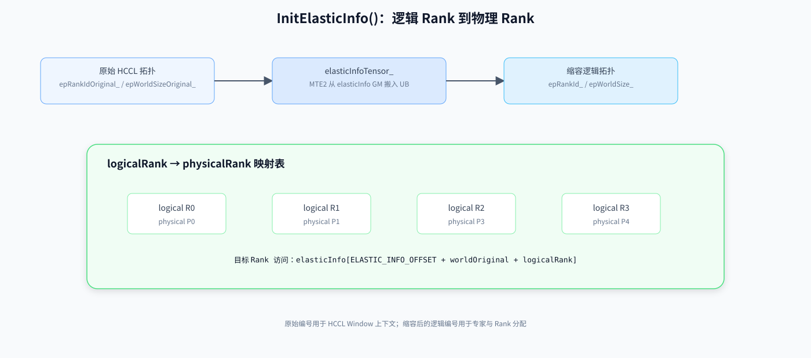

后续访问目标 Rank 时，代码通过 `elasticInfoTensor_[ELASTIC_INFO_OFFSET + epWorldSizeOriginal_ + logicalRank]` 把逻辑 Rank 转回物理 Rank。

### 1.3 `SetDataStatus()`：选择双缓冲代次和 Window 基址

`SetDataStatus()` 在状态数据区的固定偏移处为每个 AIV 取得一个 32 B 对齐的状态槽，`InitWinState()` 返回当前 `dataState_`，据此在双缓冲 Window 中选择本轮区域。

```cpp
statusDataSpaceGM_ = ctx_.GetStatusDataSpaceGm();
selfDataStatusGMTensor_.SetGlobalBuffer(
    (__gm__ uint32_t *)(statusDataSpaceGM_ + FLAG_FIELD_OFFSET + aivId_ * WIN_ADDR_ALIGN));
dataState_ = InitWinState(selfDataStatusGMTensor_, epRankIdHccl, epWorldSizeHccl,
                          epRankIdOriginal_, moeExpertNum_, epWorldSizeOriginal_,
                          globalBS_, dataStateBuf);
uint64_t hSizeAlignCombine =
    Ceil(axisH_ * COMBINE_IN_DATA_SIZE, SPLIT_BLOCK_DATA_SIZE) * SPLIT_BLOCK_SIZE;
winDataSizeOffset_ = dataState_ * (totalWinSize_ / BUFFER_NUM)
    + axisMaxBS_ * (axisK_ + sharedExpertNum_) * hSizeAlignCombine;
```

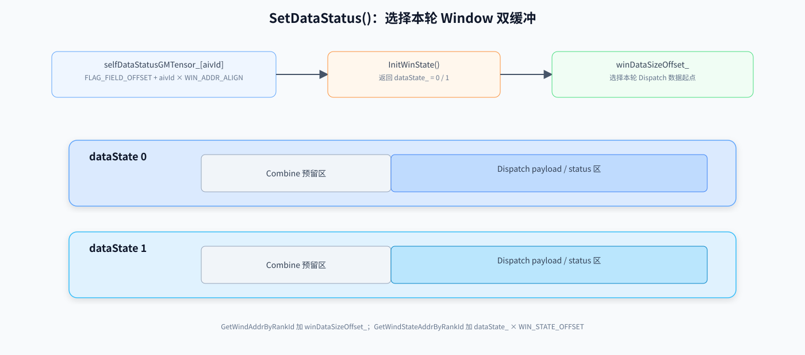

#### 1.3.1 `GetWindAddrByRankId()` / `GetWindStateAddrByRankId()` 两个内联函数都把 `epRankIdOriginal_` 作为本端物理 Rank 交给上下文。数据地址再叠加 `winDataSizeOffset_`，状态地址则叠加 `dataState_ * WIN_STATE_OFFSET`：

```cpp
return ctx_.GetWindAddrByRankId(rankId, epRankIdOriginal_) + winDataSizeOffset_;
return ctx_.GetWindStateAddrByRankId(rankId, epRankIdOriginal_)
       + dataState_ * WIN_STATE_OFFSET;
```

因此后续公式中的 `rankId` 是目标 Rank；双缓冲代次偏移已经封装在这两个函数中，调用者不能再重复加一次。

## 2. `CalCumSum()`：发送 count、接收 count、生成前缀和

### 2.0 初始化 UB

`CalCumSum()` 由后 `aivUsedCumSum_` 个核执行。它为路由比较、掩码、专家 ID 和状态块申请 UB：

```cpp
tpipe_->InitBuffer(dstExpBuf_, maxSize_);
tpipe_->InitBuffer(subExpBuf_, maxSize_);
tpipe_->InitBuffer(gatherMaskTBuf_, expertIdsBufSize_);
tpipe_->InitBuffer(expertIdsBuf_, expertIdsBufSize_);
tpipe_->InitBuffer(statusBuf_, statusCntAlign_ * UB_ALIGN);
workLocalTensor_ = gatherMaskTBuf_.Get<float>();
statusTensor_ = statusBuf_.Get<int32_t>();
ExpIdsCopyAndMaskCal();
```


### 2.1 `ExpIdsCopyAndMaskCal()`：形成有效路由数组

`ExpIdsCopyAndMaskCal()` 先把默认有效数量设为 `BS` 和 `BS*K`，再按 tiling flag 依次处理 Token mask、二维 route mask 和零计算量专家剪枝。最终 `validExpertIdsTensor_` 的无效位置为 `-1`。

真实调用顺序如下；三个开关可以同时生效，而不是互斥分支：

```cpp
activeMaskBsCnt_ = axisBS_;
sendToMoeExpTokenCnt_ = axisBS_ * axisK_;
validExpertIdsTensor_ = expertIdsBuf_.Get<int32_t>();
if (isExpertMaskFlag_ || (zeroComputeExpertNum_ != 0)) {
    ExpertActiveMaskInit();
}
if (isTokenMaskFlag_) {
    TokenActiveMaskCal();
}
if (isExpertMaskFlag_) {
    ExpertActiveMaskCal();
}
if (activeMaskBsCnt_ == 0) {
    return;
}
if (zeroComputeExpertNum_ != 0) {
    ZeroComputeExpertMaskCal();
}
```

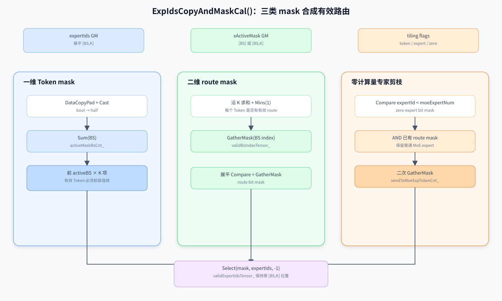

#### 2.1.1 `TokenActiveMaskCal()`：一维 Token mask

函数将 `xActiveMask[BS]` 从 GM 搬入 UB，转为 `half` 后 `Sum`，得到 `activeMaskBsCnt_`，并令 `sendToMoeExpTokenCnt_ = activeMaskBsCnt_ * axisK_`。

```cpp
DataCopyPad(maskInputTensor, xActiveMaskGMTensor_, maskParams, maskCopyPadParams);
SyncFunc<AscendC::HardEvent::MTE2_V>();
LocalTensor<int8_t> maskInputInt8Tensor = maskInputTensor.ReinterpretCast<int8_t>();
Cast(maskTmpTensor, maskInputInt8Tensor, RoundMode::CAST_NONE, axisBS_);
PipeBarrier<PIPE_V>();
Sum(sumOutTensor, maskTmpTensor, params);
SyncFunc<AscendC::HardEvent::V_S>();
activeMaskBsCnt_ = static_cast<int32_t>(sumOutTensor.GetValue(0));
sendToMoeExpTokenCnt_ = activeMaskBsCnt_ * axisK_;
```


在没有二维 expert mask 和零专家剪枝时，后续真实代码只搬 `expertIdsGMTensor_` 的前 `activeMaskBsCnt_ * axisK_` 项。因此一维 mask 对应“有效 Token 在前部连续”的契约，不是在这里对任意稀疏 Token 位置做 gather。

#### 2.1.2 `ExpertActiveMaskCal()`：二维 route mask

`ExpertActiveMaskCal()` 对同一份 `[BS,K]` mask 做两种观察：

- `CalValidBSCnt()` 沿 K 求和并压成 0/1，生成 `validBsIndexTensor_`，供共享专家发送时把紧凑 Token 序号映射回原 Token；
- `CalValidExpIdx()` 展平 mask，生成有效 route 的索引位图并统计 `sendToMoeExpTokenCnt_`。


`ExpertActiveMaskInit()` 先申请 Token 索引表和 route 计算临时区；`validBufferSize` 取 `expertIdsSize_` 与 mask Cast 空间的较大者，避免两种用途大小不一致：

```cpp
uint32_t axisBSAlign = Ceil(axisBS_ * sizeof(int32_t), UB_ALIGN) * UB_ALIGN;
uint32_t xActivateMaskSize = axisBS_ *
    (Ceil(axisK_ * sizeof(bool), UB_ALIGN) * UB_ALIGN) * sizeof(half);
tpipe_->InitBuffer(validBsIndexTBuf_, axisBSAlign);
uint32_t validBufferSize = expertIdsSize_ > xActivateMaskSize ?
                           expertIdsSize_ : xActivateMaskSize;
tpipe_->InitBuffer(validExpertIndexBuf_, validBufferSize);
validBsIndexTensor_ = validBsIndexTBuf_.Get<int32_t>();
gatherMaskTensor_ = gatherMaskTBuf_.Get<uint32_t>();
```

`CalValidBSCnt()` 的关键代码是沿 K 求和、压到 1，再 gather 原始 BS 下标：

```cpp
LocalTensor<int8_t> maskStrideInt8Tensor = maskStrideTensor.ReinterpretCast<int8_t>();
Cast(tempTensor, maskStrideInt8Tensor, RoundMode::CAST_NONE, activeMaskAlignSize);
Sum(tokenTargetTensor, tempTensor, axisKSumParams);
Mins(maskTempTensor, tokenTargetTensor, static_cast<half>(1), axisBS_);
CompareScalar(maskTensor, maskTempTensor, static_cast<half>(1),
              AscendC::CMPMODE::EQ, calCnt);
CreateVecIndex(bsIndexTensor, 0, axisBS_);
GatherMask(validBsIndexTensor_, bsIndexTensor, maskTensorInt32, true,
           axisBS_, {1, 1, 0, 0}, activeMaskBsCnt_);
```

`CalValidExpIdx()` 则直接对展平的 `BS*K` mask 比较并 gather route 下标，返回值写入 `sendToMoeExpTokenCnt_`。这个索引表只用于形成 mask；后续 `Select` 仍保持原始 `[BS,K]` 位置，并不把 `expertIds` 压紧。

#### 2.1.3 `ZeroComputeExpertMaskCal()`：剪掉特殊专家

`MaskZeroComputeExpert()` 重新读取 `expertIds`，以 `expertId < moeExpertNum_` 形成新位图，与已有 route mask 按位 `And`，再 `GatherMask` 统计剪枝后的 route 数。

当没有二维 expert mask 时，`GenerateGatherMaskTensor(maskCnt)` 先把整张 bit mask 清零，再把前 `maskCnt` 个位置置 1；这样零专家 mask 才有可相与的基础 mask：

```cpp
Duplicate<uint32_t>(gatherMaskTensor_, 0, Ceil(expertIdsCnt_, UB_ALIGN));
PipeBarrier<PIPE_V>();
Duplicate<uint32_t>(gatherMaskTensor_, 0xFFFFFFFF, Ceil(maskCnt, UB_ALIGN));
PipeBarrier<PIPE_V>();
```

真正的相与和二次 gather 是：

```cpp
CompareScalar(maskTensorInt8, expertIdsTensorCast,
              static_cast<half>(moeExpertNumInt32), AscendC::CMPMODE::LT, calcCnt);
PipeBarrier<PIPE_V>();
And(gatherMaskTensorint16, gatherMaskTensorint16,
    maskTensorInt16, maskTensorInt16Cnt);
CreateVecIndex(expertsIndexTensor, 0, expertIdsCnt_);
GatherMask(validExpertIndexTensor, expertsIndexTensor, gatherMaskTensor_, true,
           maskCnt, {1, 1, 0, 0}, sendToMoeExpTokenCnt_);
```


最后 `ExpIdsCopyAndMaskCal()` 先把整个对齐后的 `validExpertIdsTensor_` 填成 `-1`。存在二维 mask/零专家时，用 `Select(mask, expertIds, -1)` 保留原展平位置；否则直接搬前 `activeMaskBsCnt_*K` 项。可选的 `expertScales` 也从 GM 连续搬到 `expertScalesTensor_`。

### 2.2 `CalAndSendCntByRank()`：3510 常规路径按目标 Rank 批量写状态

无 `elasticInfo` 时调用 `CalAndSendCntByRank()`。函数先把 `statusTensor_` 全部清零，再用掩码把每个 32 B 块的第 0 个 `int32` 写为 `0x3F800000`，即按 float 解释的 `1.0f`：

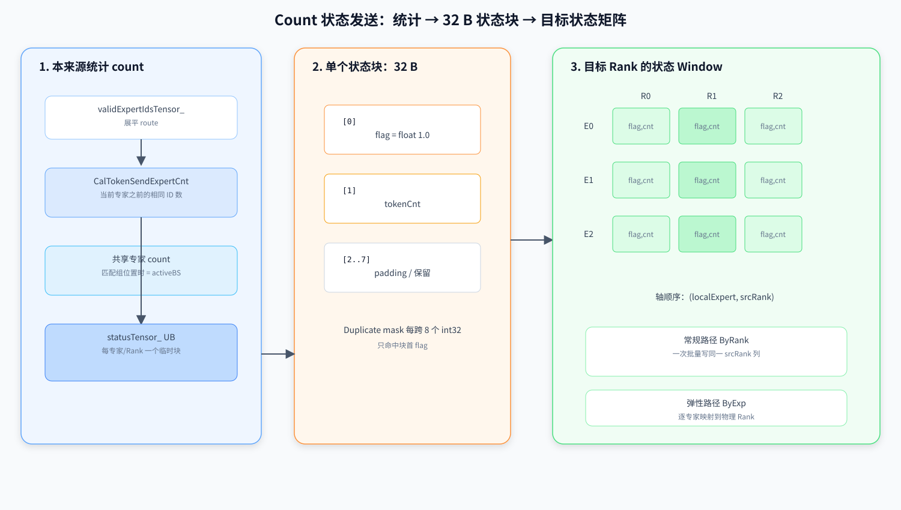

当前 CumSum 核的 `newAivId = aivId_ - aivUsedAllToAll_`。它以步长 `aivUsedCumSum_` 负责目标 Rank：

```cpp
for (uint32_t dstRankId = newAivId; dstRankId < epWorldSize_;
     dstRankId += aivUsedCumSum_) {
    if (dstRankId >= sharedExpertRankNum_) {
        startExpertId = (dstRankId - sharedExpertRankNum_) * moeExpertNumPerRank_;
        endExpertId = startExpertId + moeExpertNumPerRank_;
        for (uint32_t curMoeExpertId = startExpertId;
             curMoeExpertId < endExpertId; ++curMoeExpertId) {
            int32_t curExpertCnt = 0;
            int32_t cntPosIndex =
                (curMoeExpertId + sharedExpertRankNum_) * UB_ALIGN_DATA_COUNT + 1;
            if (sendToMoeExpTokenCnt_ > 0) {
                CalTokenSendExpertCnt(curMoeExpertId, maskCnt, curExpertCnt);
            }
            statusTensor_.SetValue(cntPosIndex, curExpertCnt);
        }
    } else {
        int32_t curExpertCnt = 0;
        int32_t cntPosIndex = dstRankId * UB_ALIGN_DATA_COUNT + 1;
        if (activeMaskBsCnt_ > 0) {
            if (dstRankId % rankNumPerSharedExpert_ == epRankId_ % rankNumPerSharedExpert_) {
                curExpertCnt = activeMaskBsCnt_;
            }
        }
        statusTensor_.SetValue(cntPosIndex, curExpertCnt);
    }
}
```

对于 MoE Rank，函数遍历该 Rank 上的全部本地专家，并调用 `CalTokenSendExpertCnt(curMoeExpertId, maskCnt, curExpertCnt)` 统计本来源发送量。对于共享专家 Rank，只有与本 Rank 位于同一共享专家组位置时才发送 `activeMaskBsCnt_`。

状态 Window 的逻辑轴是 `(localExpert, srcRank)`，一个格子 32 B：

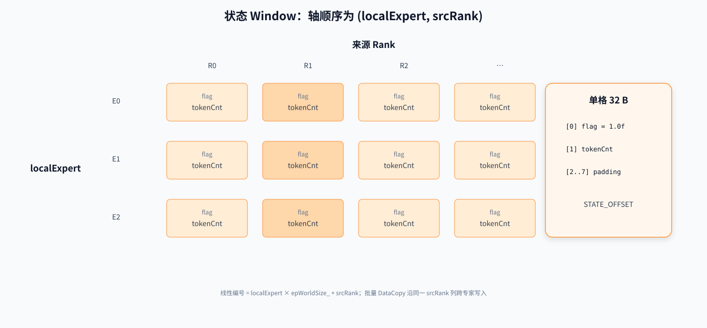

真正的批量 `DataCopy` 为：

```cpp
DataCopyParams cntCopyParams = {
    uint16_t(moeExpertNumPerRank_), 1U, 0U, uint16_t(epWorldSize_ - 1)};
DataCopy<int32_t>(rankGMTensor,
    statusTensor_[startStatusIdx * UB_ALIGN_DATA_COUNT], cntCopyParams);
```

每次从 UB 连续取一个 32 B 状态块，目标侧跨过同一专家的其余 `epWorldSize_-1` 个来源格，因此沿“本地专家”维写入本来源列。共享专家 Rank 只有一个状态块，直接拷 8 个 `int32`。

### 2.3 `CalAndSendCntByExp()`：3510 弹性路径逐专家写状态

有 `elasticInfo` 时调用 `CalAndSendCntByExp()`。`SplitToCore(totalExpertNum_, ..., false)` 给每个 CumSum 核一个连续专家区间。每算出一个专家的 count，就立刻把对应 32 B 块写到映射后的物理 Rank。

```cpp
for (uint32_t curExpertId = startExpertId; curExpertId < endExpertId; ++curExpertId) {
    int32_t curExpertCnt = 0;
    int32_t cntPosIndex = (curExpertId - startExpertId) * 8 + 1;
    if ((curExpertId < sharedExpertRankNum_) && (activeMaskBsCnt_ > 0)) {
        if (curExpertId % rankNumPerSharedExpert_ == epRankId_ % rankNumPerSharedExpert_) {
            curExpertCnt = activeMaskBsCnt_;
        }
    } else if (sendToMoeExpTokenCnt_ > 0) {
        CalTokenSendExpertCnt(curExpertId - sharedExpertRankNum_, maskCnt, curExpertCnt);
    }
    statusTensor_.SetValue(cntPosIndex, curExpertCnt);
    uint32_t dstRankId = curExpertId;
    uint32_t offset = STATE_OFFSET * epRankId_;
    if (curExpertId >= sharedExpertRankNum_) {
        dstRankId = (curExpertId - sharedExpertRankNum_) / moeExpertNumPerRank_
                    + sharedExpertRankNum_;
        offset += (curExpertId - sharedExpertRankNum_) % moeExpertNumPerRank_
                  * epWorldSize_ * STATE_OFFSET;
    }
    dstRankId = elasticInfoTensor_.GetValue(
        ELASTIC_INFO_OFFSET + epWorldSizeOriginal_ + dstRankId);
    rankGMTensor.SetGlobalBuffer(
        (__gm__ int32_t *)(GetWindStateAddrByRankId(dstRankId) + offset));
    DataCopy<int32_t>(rankGMTensor,
        statusTensor_[(curExpertId - startExpertId) * UB_ALIGN_DATA_COUNT],
        UB_ALIGN_DATA_COUNT);
}
```


常规路径按 Rank 批量写，弹性路径逐专家写，是因为逻辑专家到物理 Rank 的映射需要逐项解析；两条路径写出的状态块格式相同。

### 2.4 `SplitToCore()`：把接收状态流切成连续区间

发送状态后，3510 调用：

```cpp
SplitToCore(rscvStatusNum_, aivUsedCumSum_,
    startStatusIndex_, endStatusIndex_, recStatusNumPerCore_, false);
```

`SplitToCore()` 使用商和余数切分，余数由前面的 `newAivId` 各多承担一项，得到半开区间 `[startStatusIndex_, endStatusIndex_)`。

```cpp
sendTokenNum = curSendCnt / curUseAivNum;
uint32_t remainderTokenNum = curSendCnt % curUseAivNum;
uint32_t newAivId;
if (isFront) {
    newAivId = aivId_;
} else if (aivId_ >= aivUsedAllToAll_) {
    newAivId = aivId_ - aivUsedAllToAll_;
} else {
    newAivId = aivId_ - moeUsedAivNum_;
}
startTokenId = sendTokenNum * newAivId;
if (newAivId < remainderTokenNum) {
    sendTokenNum += 1;
    startTokenId += newAivId;
} else {
    startTokenId += remainderTokenNum;
}
endTokenId = startTokenId + sendTokenNum;
```

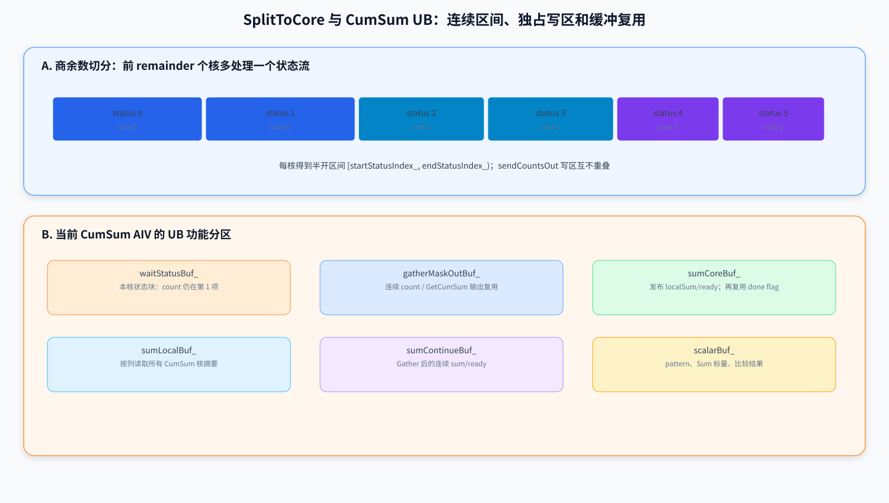

线性状态流在共享专家 Rank 上等于 `srcRank`；在 MoE Rank 上等于 `localExpert * epWorldSize_ + srcRank`。

### 2.5 `BufferInit()`：接收和前缀和阶段的 UB

`BufferInit()` 在状态发送结束后申请新的接收缓冲。关键区域是：

```cpp
uint32_t waitStatusBufSize =
    Ceil(recStatusNumPerCore_ * UB_ALIGN, SIZE_ALIGN_256) * SIZE_ALIGN_256;
tpipe_->InitBuffer(waitStatusBuf_, waitStatusBufSize);
uint64_t recStatusNumPerCoreSpace =
    Ceil(recStatusNumPerCore_ * sizeof(float), UB_ALIGN) * UB_ALIGN;
uint64_t recvWinBlockNumSpace = epWorldSize_ * moeExpertNumPerRank_ * sizeof(float);
uint64_t gatherMaskOutSize = recStatusNumPerCoreSpace > recvWinBlockNumSpace ?
                             recStatusNumPerCoreSpace : recvWinBlockNumSpace;
tpipe_->InitBuffer(gatherMaskOutBuf_, gatherMaskOutSize);
tpipe_->InitBuffer(sumCoreBuf_, aivNum_ * UB_ALIGN);
tpipe_->InitBuffer(sumLocalBuf_, aivNum_ * UB_ALIGN);
tpipe_->InitBuffer(sumContinueBuf_,
    Ceil(aivNum_ * sizeof(float), UB_ALIGN) * UB_ALIGN);
tpipe_->InitBuffer(scalarBuf_, UB_ALIGN * 3);
```


### 2.6 `WaitDispatch()`：等待 count 状态块

`WaitDispatch()` 反复把本核区间的状态块搬到 `waitStatusBuf_`，只对每块第一个 float 求和：

```cpp
while (sumOfFlag != compareTarget) {
    DataCopy(statusFp32Tensor_,
        windowInstatusFp32Tensor_[startStatusIndex_ * STATE_OFFSET / sizeof(float)],
        intriParams);
    ReduceSum(statusSumOutTensor, statusFp32Tensor_, gatherMaskOutTensor,
              1, recStatusNumPerCore_, 1);
    sumOfFlag = statusSumOutTensor.GetValue(0);
}
```

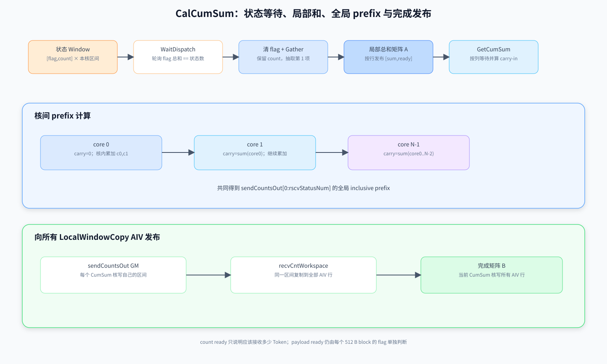

如果开启性能统计，轮询期间 `RecordRankCommDuration()` 记录各来源 Rank 首次出现 `flag > 0.5` 的耗时，最后以 atomic max 合并到 `performanceInfoGMTensor_`。

#### 2.6.1 `RecordRankCommDuration()`：记录来源 Rank 首次到达

真实判断还包含 `performanceFlagTensor_[i] == 0`，保证同一状态块只记录首次到达；同一来源 Rank 若对应多个本地专家，则保留这些状态块中的最大耗时：

```cpp
SyncFunc<AscendC::HardEvent::MTE2_S>();
uint64_t endTime = static_cast<uint64_t>(GetSystemCycle());
int32_t duration = static_cast<int32_t>((endTime - startTime) / CYCLES_PER_US);
for (uint32_t i = 0; i < recStatusNumPerCore_; i++) {
    float statusFp32 = statusFp32Tensor_.GetValue(i * FLAG_OFFSET);
    int32_t performanceFlag = performanceFlagTensor_.GetValue(i);
    if (statusFp32 > float(0.5) && performanceFlag == 0) {
        performanceFlagTensor_.SetValue(i, 1);
        uint32_t fromLocalRankId = (startStatusIndex_ + i) % epWorldSize_;
        uint32_t fromRankId = isScalingDownFlag_ ?
            elasticInfoTensor_.GetValue(
                ELASTIC_INFO_OFFSET + epWorldSizeOriginal_ + fromLocalRankId) :
            fromLocalRankId;
        int32_t savedTime = performanceInfoTensor.GetValue(fromRankId * DURATION_OFFSET);
        int32_t newValue = (duration > savedTime) ? duration : savedTime;
        if (newValue != savedTime) {
            performanceInfoTensor.SetValue(fromRankId * DURATION_OFFSET, duration);
        }
    }
}
```

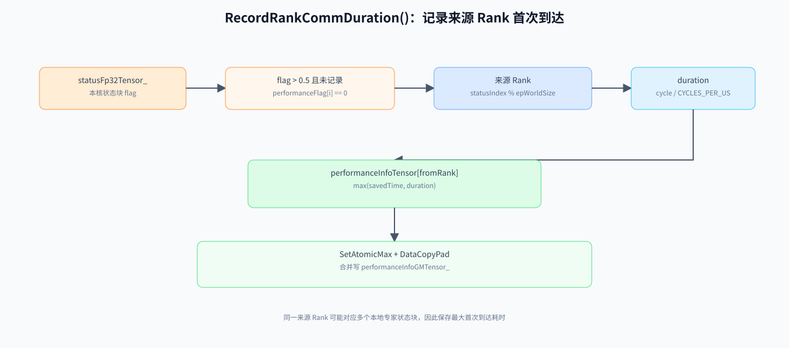

#### 2.6.2 `WaitDispatchClearStatus()`：只清 ready flag

所有 flag 到齐后，该函数在 UB 中按“每 8 个 int32 置零第一个”的掩码生成清理数据，再写回相同状态区。count 保持不变，供紧接着的 `GatherSumRecvCnt()` 使用。

```cpp
DataCopyParams intriOutParams{static_cast<uint16_t>(recStatusNumPerCore_), 1, 0, 0};
uint64_t duplicateMask[2] = {0x101010101010101, 0};
LocalTensor<int32_t> cleanStateTensor = waitStatusBuf_.Get<int32_t>();
Duplicate<int32_t>(cleanStateTensor, 0, duplicateMask,
                   Ceil(recStatusNumPerCore_, 8), 1, 8);
SyncFunc<AscendC::HardEvent::V_MTE3>();
DataCopy(windowInstatusFp32Tensor_[startStatusIndex_ * STATE_OFFSET / sizeof(float)],
         cleanStateTensor.ReinterpretCast<float>(), intriOutParams);
```

注意 `cleanStateTensor` 就是刚刚读入状态块的 `waitStatusBuf_`，`Duplicate` 只改每块第 0 项，随后整块写回，所以第 1 项 count 才能原样保留。


状态 flag 此时可以供下一轮复用，但 payload Window flag 要到 `LocalWindowCopy()` 消费完对应数据后才清。

#### 2.6.3 `GatherSumRecvCnt()`：抽取 count 并发布本核局部和

`GatherMask` 的 pattern 为 2，因而从每个 32 B 状态块取第 1 项 `tokenCnt`，形成连续数组，再 `Sum` 得到 `sumOfRecvCnt`。

```cpp
gatherTmpTensor.SetValue(0, 2);
GatherMask(gatherMaskOutTensor, statusFp32Tensor_, gatherTmpTensor, true, 2,
           {1, static_cast<uint16_t>(recStatusNumPerCore_), 1, 0}, recvCnt);
SumParams sumParams{1, recStatusNumPerCoreInner, recStatusNumPerCore_};
Sum(statusSumOutTensor, gatherMaskOutTensor, sumParams);
float sumOfRecvCnt = statusSumOutTensor.GetValue(0);

Duplicate<float>(sumCoreFP32Tensor, sumOfRecvCnt,
                 maskArrayCount, repeatTimes, 1, 8);
Duplicate<float>(sumCoreFP32Tensor, static_cast<float>(1.0),
                 maskArrayFlag, repeatTimes, 1, 8);
DataCopy(cumsumWsGMTensor_[
             (newAivId * aivUsedCumSum_ * UB_ALIGN) / sizeof(float)],
         sumCoreFP32Tensor, sumIntriParams);
```


随后当前 CumSum 核把 `[sumOfRecvCnt, ready=1]` 重复 `aivUsedCumSum_` 份，写入 `cumsumWsGMTensor_` 区域 A 的整行。每个目标 CumSum 核因此都能只读自己那一列，而不与其他核争用同一 UB/GM 地址。

### 2.7 `CalRecvAndSetFlag()`：核间前缀 + 核内前缀

#### 2.7.1 `GetCumSum()`：等待所有局部和并计算 carry-in

`GetCumSum()` 从区域 A 按跨步读取当前 `newAivId` 列，先 gather 每块第 1 项 ready 并求和；只有总和等于 `aivUsedCumSum_` 才退出轮询。

```cpp
DataCopyParams sumIntriParams{
    static_cast<uint16_t>(aivUsedCumSum_), 1,
    static_cast<uint16_t>(aivUsedCumSum_ - 1), 0};
while (true) {
    DataCopy(sumLocalTensor,
             cumsumWsGMTensor_[(newAivId * UB_ALIGN) / sizeof(float)],
             sumIntriParams);
    GatherMask(sumContinueTensor, sumLocalTensor, gatherSumPattern, true, 2,
               {1, static_cast<uint16_t>(aivUsedCumSum_), 1, 0}, recvCnt);
    Sum(recvCntSumOutTensor, sumContinueTensor, sumParams);
    cumSumFlag = static_cast<int32_t>(recvCntSumOutTensor.GetValue(0));
    if (cumSumFlag == aivUsedCumSum_) {
        break;
    }
}
```

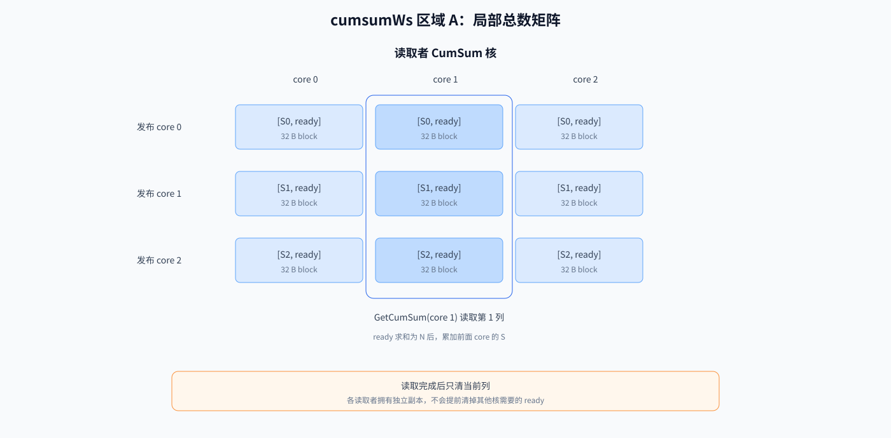

`newAivId == 0` 时 carry-in 直接为 0；其余核对 `[sum0, ..., sum(newAivId-1)]` 求和。完成后本核把自己读取的这一列清零，供下一轮软同步复用。

#### 2.7.2 写 `sendCountsOut` 和每个 AIV 的 Workspace 行

`CalRecvAndSetFlag()` 以 carry-in 为起点，逐个累加本核状态区间内的 count：

```cpp
uint32_t curCnt = preSum;
for (uint32_t index = startStatusIndex_; index < endStatusIndex_; index++) {
    uint32_t i = index - startStatusIndex_;
    uint32_t count = waitStatusTensor_.GetValue(i * UB_ALIGN_DATA_COUNT + 1);
    curCnt += count;
    outCountLocal.SetValue(i, curCnt);
}
```

这是真实的全局 inclusive prefix。每个 CumSum 核只写自己的不重叠区间：


代码把同一区间复制到 `aivNum_` 行。最后当前 CumSum 核沿区域 B 的同一列为全部 AIV 写 `1`：

```cpp
DataCopyPad(sendCountsGlobal[startStatusIndex_], outCountLocal, dataCopyOutParams);
for (uint32_t index = 0; index < aivNum_; index++) {
    DataCopyPad(workspaceGlobal[index * rscvStatusNum_ + startStatusIndex_],
                outCountLocal, dataCopyOutParams);
}
Duplicate<int32_t>(syncOnCoreTensor, 1,
                   SIZE_ALIGN_256 / sizeof(int32_t), repeatTimes, 1, 8);
DataCopy(cumsumWsGMTensor_[
             (CUMSUM_WS_FLAG_OFFSET + newAivId * UB_ALIGN) / sizeof(float)],
         syncOnCoreFP32Tensor, sumIntriParams);
```


这一步表示“该 CumSum 核负责的 prefix 区间已经补齐”，不表示 payload 到达。

### 2.8 3510 不调用 `SetExpertTokenNums()`

`CalCumSum()` 末尾的调用被 `#if !(__NPU_ARCH__ == 3510)` 排除。3510 在后续 `LocalWindowCopy() -> SetValidExpertInfo()` 中由 `aivId_ == 0` 的核从完整 prefix 末值推导 `expertTokenNumsOut`，见 4.3。

## 3. `AllToAllDispatch()`：把 Token 写入远端预留槽位

### 3.0 初始化量化、路由和发送缓冲

`AllToAllDispatch()` 由前 `aivUsedAllToAll_` 个核执行。3510 用两个 `TBufPool` 建立双缓冲 `inQueue`；MX/PERGROUP 量化先把输入缓冲填为 `QUANT_PADDING_VALUE`，避免量化按 256 B 搬入时读到脏数据。

```cpp
AscendC::TBufPool<AscendC::TPosition::VECIN> tbufPool0, tbufPool1;
tpipe_->InitBufPool(tbufPool0, BUFFER_NUM * hAlignSize_);
tpipe_->InitBufPool(tbufPool1, BUFFER_NUM * hAlignSize_, tbufPool0);
tbufPool0.InitBuffer(inQueue, BUFFER_NUM, hAlignSize_);
tbufPool1.InitBuffer(inQueueCleanBuf, BUFFER_NUM * hAlignSize_);
if constexpr ((QuantMode == MX_QUANT) ||
              (QuantMode == PERGROUP_DYNAMIC_QUANT) ||
              (QuantMode == MX_QUANT_CLIP)) {
    LocalTensor<uint8_t> inTensor8 = inQueueCleanBuf.Get<uint8_t>();
    Duplicate(inTensor8, QUANT_PADDING_VALUE, BUFFER_NUM * hAlignSize_);
}
tpipe_->InitBuffer(expertIdsBuf_, expertIdsBufSize_);
if (hasExpertScalesFlag_) {
    tpipe_->InitBuffer(expertScalesBuf_, expertIdsBufSize_);
}
```

`needMaskCalFlag` 和量化类型决定 `dstExpBuf_ / subExpBuf_` 是新申请还是复用量化临时缓冲。3510 无论是否需要 mask，都会额外申请 `calTempBuf` 并令 `workLocalTensor_ = calTempBuf.Get<float>()`，因为 `CalTokenSendExpertCnt()` 的 `ReduceSum` 需要工作区。

初始化结束处把量化临时 Tensor 和动态 scale 输出交给 `quantInst_`，然后才生成有效 expert ID：

```cpp
quantInst_.SetQuantInitParams(floatLocalTemp_, smoothScalesTensor_,
                              smoothScalesBuf, dynamicScalesOutGMTensor_);
ExpIdsCopyAndMaskCal();
if (activeMaskBsCnt_ == 0) {
    return;
}
AllToAllDispatchA5(inQueue, expertMaskBuf, outBuf);
```

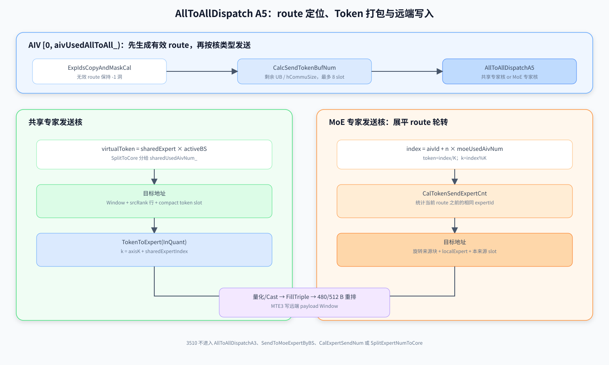

完成 `ExpIdsCopyAndMaskCal()` 后，若 `activeMaskBsCnt_ == 0` 直接返回；否则 3510 固定进入 `AllToAllDispatchA5()`。

### 3.1 `AllToAllDispatchA5()`：划分共享专家核与 MoE 专家核

```cpp
CalcSendTokenBufNum(outBuf);
if ((aivId_ >= moeUsedAivNum_) && (sharedExpertRankNum_ != 0)) {
    SendToSharedExpert(inQueue, outBuf);
} else {
    SendToMoeExpert(inQueue, expertMaskBuf, outBuf);
}
```

`CalcSendTokenBufNum()` 用 UB 物理地址计算剩余空间，按 `hCommuSize_` 换算发送 slot 数，并限制为最多 8 个有效 event flag。若连一个 slot 都放不下，后续发送函数没有可用循环缓冲。

```cpp
tpipe_->InitBuffer(calEndBuf_, UB_ALIGN);
uint64_t beiginUbAddr = calBeginBuf_.Get<uint8_t>().GetPhyAddr();
uint64_t endUbAddr = calEndBuf_.Get<uint8_t>().GetPhyAddr();
uint64_t remainUbSize = totalUbSize_ - (endUbAddr - beiginUbAddr + UB_ALIGN);
sendTokenBufNum_ = remainUbSize / hCommuSize_;
if (sendTokenBufNum_ > VALID_EVENT_FLAG_NUM) {
    sendTokenBufNum_ = VALID_EVENT_FLAG_NUM;
}
if (sendTokenBufNum_ == 0) {
    return;
}
tpipe_->InitBuffer(outBuf, hCommuSize_ * sendTokenBufNum_);
outTensor_ = outBuf.Get<XOutType>();
```


文件中还定义了 `SendToMoeExpertByBS()`、`CalcBSTokenRange()` 和 `SendBSExpertLoop()`，但它们只从 `AllToAllDispatchA3()` 调用。3510 的条件编译选择 `AllToAllDispatchA5()`，因此这些函数不属于本走读主路径。

### 3.2 `SendToSharedExpert()`：同一 Token 发送给每个共享专家

`SendToSharedExpert()` 把 `activeMaskBsCnt_ * sharedExpertNum_` 个虚拟任务分给共享专家核。任务索引被还原为：

发送前先把全部 `outBuf` slot 初始化为 `1.0f`，再为每个 slot 设置一个 `MTE3_V` 初始事件，表示“该 slot 当前可以由 Vector 流水覆盖”：

```cpp
LocalTensor<float> outTensorFp32 = outBuf.Get<float>();
Duplicate<float>(outTensorFp32, float(1),
                 hCommuSize_ * sendTokenBufNum_ / sizeof(float));
PipeBarrier<PIPE_V>();
uint32_t curSendCnt = activeMaskBsCnt_ * sharedExpertNum_;
SplitToCore(curSendCnt, sharedUsedAivNum_,
            startTokenId, endTokenId, sendTokenNum, false);
syncFlagId_ = 0;
for (int i = 0; i < sendTokenBufNum_; i++) {
    AscendC::SetFlag<AscendC::HardEvent::MTE3_V>(i % sendTokenBufNum_);
}
```

```cpp
uint32_t sendTokenIndex = virtualTokenIndex % activeMaskBsCnt_;
uint32_t toSharedExpertIndex = virtualTokenIndex / activeMaskBsCnt_;
int32_t toRankId = idInSharedGroup + toSharedExpertIndex * rankNumPerSharedExpert_;
```

目标 Window 地址为：

```cpp
GetWindAddrByRankId(toRankId)
    + expertPerSizeOnWin_ * epRankId_
    + sendTokenIndex * hCommuSize_
```

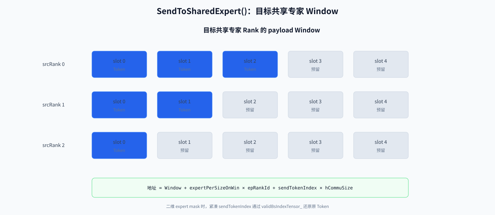

二维 expert mask 开启时，`validBsIndexTensor_[sendTokenIndex]` 把紧凑索引还原为原始 `srcTokenIndex`。共享专家三元组中的 `k` 写为 `axisK_ + toSharedExpertIndex`，与普通 Top-K 路由区分。

实际发送选择由编译期模板决定，量化、类型转换或输入输出类型不同走 `TokenToExpertInQuant()`，否则走 `TokenToExpert()`：

```cpp
if constexpr ((QuantMode > UNQUANT) ||
              (QuantMode == UNQUANT && !Std::IsSame<ExpandXOutType, XType>::value)) {
    uint32_t fillExpertIdx = axisK_ + toSharedExpertIndex;
    uint32_t quantExpertIdx = toSharedExpertIndex;
    TokenToExpertInQuant(dstWinGMTensor, inQueue, srcTokenIndex,
                         fillExpertIdx, quantExpertIdx);
} else {
    TokenToExpert(dstWinGMTensor, inQueue, srcTokenIndex,
                  axisK_ + toSharedExpertIndex);
}
```

### 3.3 `SendToMoeExpert()`：按展平 route 轮转分核

3510 分支 `SendToMoeExpert()` 让第 `aivId_` 个 MoE 发送核处理：

```cpp
for (int32_t index = aivId_; index < validTokenNum; index += moeUsedAivNum_) {
    int32_t tokenId = index / axisK_;
    int32_t topKId = index % axisK_;
    int32_t expertId = validExpertIdsTensor_(index);
    if (expertId >= moeExpertNum_ || expertId < 0) continue;
    int32_t toRankId = expertId / moeExpertNumPerRank_ + sharedExpertRankNum_;
    if (isScalingDownFlag_) {
        toRankId = elasticInfoTensor_.GetValue(
            ELASTIC_INFO_OFFSET + epWorldSizeOriginal_ + toRankId);
    }
    CalTokenSendExpertCnt(expertId, index, dstTokenIdx);
    dstWinGMTensor.SetGlobalBuffer(
        (__gm__ XOutType *)(uint64_t(GetWindAddrByRankId(toRankId))
        + expertPerSizeOnWin_ * (
            (epRankId_ + toRankId) % epWorldSize_ * moeExpertNumPerRank_
            + expertId % moeExpertNumPerRank_)
        + dstTokenIdx * hCommuSize_));
    if (hasElasticInfoFlag_) {
        dstWinGMTensor.SetGlobalBuffer(
            (__gm__ XOutType *)(uint64_t(GetWindAddrByRankId(toRankId))
            + expertPerSizeOnWin_ *
                (epRankId_ * moeExpertNumPerRank_ + expertId % moeExpertNumPerRank_)
            + dstTokenIdx * hCommuSize_));
    }
    if constexpr ((QuantMode > UNQUANT) ||
                  (QuantMode == UNQUANT &&
                   !Std::IsSame<ExpandXOutType, XType>::value)) {
        TokenToExpertInQuant(dstWinGMTensor, inQueue, tokenId, topKId,
                             expertId + sharedExpertNum_);
    } else {
        TokenToExpert(dstWinGMTensor, inQueue, tokenId, topKId);
    }
}
```

也就是说分核对象是展平 `(token,k)` 下标，不是专家。mask 后仍保持原展平位置的 `-1` 洞，循环遇到洞直接跳过。

#### 3.3.1 `CalTokenSendExpertCnt()`：计算本来源内的目标 slot

函数统计当前 route 之前有多少个 `expertId == dstExpertId`。它生成常量向量，做 `Sub -> Abs -> Mins(...,1) -> ReduceSum`：不同专家得到 1，相同专家得到 0；最后用 `calCnt - differentCount` 得到相同专家数量。

```cpp
if (calCnt < axisK_) {
    curExpertCnt = 0;
    return;
}
Duplicate<int32_t>(dstExpIdTensor, dstExpertId, calCnt);
Sub(subExpIdTensor, validExpertIdsTensor_, dstExpIdTensor, calCnt);
LocalTensor<float> tmpFp32 = subExpIdTensor.ReinterpretCast<float>();
LocalTensor<float> tmpoutFp32 = dstExpIdTensor.ReinterpretCast<float>();
Abs(tmpoutFp32, tmpFp32, calCnt);
Mins(subExpIdTensor, dstExpIdTensor, 1, calCnt);
ReduceSum<float>(tmpoutFp32, tmpFp32, workLocalTensor_, calCnt);
SyncFunc<AscendC::HardEvent::V_S>();
int32_t curOtherExpertCnt = dstExpIdTensor(0);
if (calCnt >= curOtherExpertCnt) {
    curExpertCnt = calCnt - curOtherExpertCnt;
} else {
    curExpertCnt = 0;
}
```

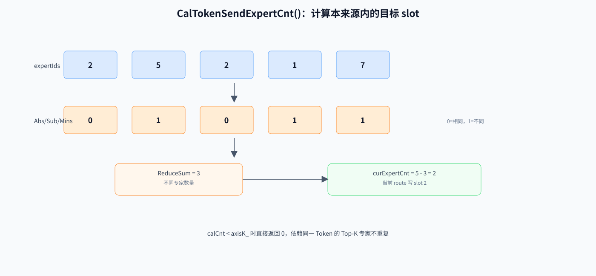

`calCnt < axisK_` 时直接返回 0，依赖“同一 Token 的 Top-K 不重复专家”。

#### 3.3.2 目标数据 Window 地址

无弹性信息的 3510 地址公式是：

```cpp
GetWindAddrByRankId(toRankId)
  + expertPerSizeOnWin_ * (
      (epRankId_ + toRankId) % epWorldSize_ * moeExpertNumPerRank_
      + expertId % moeExpertNumPerRank_)
  + dstTokenIdx * hCommuSize_
```

`(epRankId_ + toRankId) % epWorldSize_` 是接收侧使用的旋转来源编号。`LocalWindowCopy()` 中会用完全对应的旋转公式恢复这一维。存在弹性信息时，数据区改用 `epRankId_ * moeExpertNumPerRank_ + localExpertIdx`，不旋转。

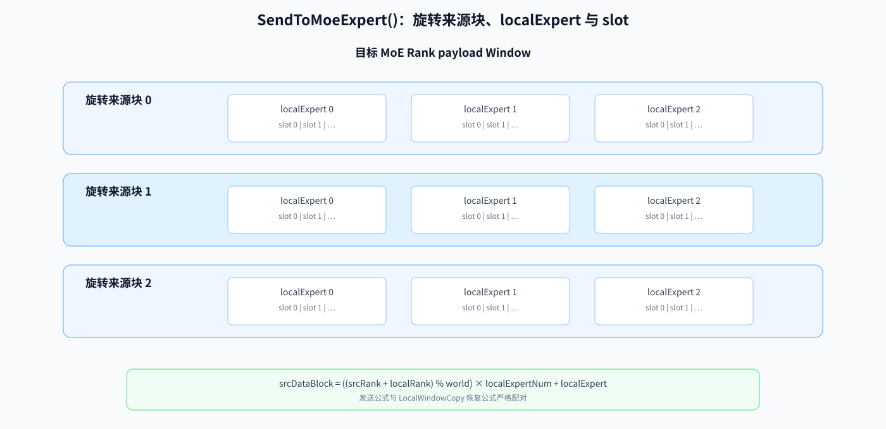

### 3.4 `TokenToExpertInQuant()`：量化/转型后写 Window

当 `QuantMode > UNQUANT`，或输入输出类型不同，进入 `TokenToExpertInQuant()`：

1. `DataCopyPad` 把 `x[srcTokenIndex]` 从 GM 搬进 `inQueue`；
2. 量化模式调用 `quantInst_.QuantProcess()`，非量化但类型不同的 3510 分支执行两次 `Cast`；
3. `FillTriple()` 写来源 Rank、原 Token 下标、Top-K 下标，可选写 `expertScale`；
4. 两次 `Copy` 把紧凑的每 480 B 数据重排到 `outBuf` 的 512 B 分块中；
5. `DataCopy` 将整个 `hCommuSize_` slot 写到远端 Window。

对应 3510 的实际搬运与 event 顺序如下：

```cpp
DataCopyPad(xInTensor, xGMTensor_[srcTokenIndex * axisH_],
            hCopyParams_, copyPadParams);
inQueue.EnQue(xInTensor);
xInTensor = inQueue.DeQue<XInType>();
if constexpr (QuantMode > UNQUANT) {
    quantInst_.QuantProcess(tempTensor_, xInTensor,
                            quantExpertIdx, scalesCount_, scalesGMTensor_);
} else {
    Cast(floatLocalTemp_, xInTensor, RoundMode::CAST_NONE, axisH_);
    Cast(tempTensor_, floatLocalTemp_, RoundMode::CAST_ROUND, axisH_);
}
inQueue.FreeTensor<XInType>(xInTensor);
FillTriple(tempTensor_, srcTokenIndex, fillExpertIdx);
AscendC::WaitFlag<AscendC::HardEvent::MTE3_V>(
    syncFlagId_ % sendTokenBufNum_);
Copy(outTensorInt32, tempTensorInt32, uint64_t(64),
     uint8_t(blockCntPerToken_), {1, 1, 16, 15});
Copy(outTensorInt32[64], tempTensorInt32[64], uint64_t(56),
     uint8_t(blockCntPerToken_), {1, 1, 16, 15});
AscendC::SetFlag<AscendC::HardEvent::V_MTE3>(
    syncFlagId_ % sendTokenBufNum_);
AscendC::WaitFlag<AscendC::HardEvent::V_MTE3>(
    syncFlagId_ % sendTokenBufNum_);
DataCopy(dstWinGMTensor,
         outTensor_[(syncFlagId_ % sendTokenBufNum_) * axisHCommu_], axisHCommu_);
AscendC::SetFlag<AscendC::HardEvent::MTE3_V>(
    syncFlagId_ % sendTokenBufNum_);
syncFlagId_++;
```

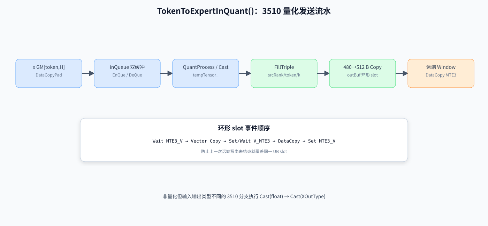

`outBuf` 一开始整区被填为 float `1.0`，随后只有每个 512 B 块前 480 B 被实际数据覆盖，所以末尾 32 B 保留 ready 标志。循环 slot 通过 `MTE3_V/V_MTE3` event 成对保护，避免 MTE3 尚未完成时复用同一 UB slot。

### 3.5 `TokenToExpert()`：不量化且类型相同

`TokenToExpert()` 的发送布局与上节相同，区别是数据直接来自 `xInTensor`。若 `IsSmoothScaleExist`，函数把 Token 和对应输入 scale 都搬到同一 UB 区；随后 `FillTriple()`、480/512 B 重排和远端 `DataCopy` 完全一致。

```cpp
if constexpr (!IsSmoothScaleExist) {
    DataCopyPad(xInTensor, xGMTensor_[srcTokenIndex * axisH_],
                hCopyParams_, copyPadParams);
} else {
    DataCopyParams scaleInParams = {1U, static_cast<uint16_t>(scaleInBytes_), 0U, 0U};
    auto tmp = scalesGMTensor_.ReinterpretCast<uint8_t>();
    DataCopyPad(xInTensor, xGMTensor_[srcTokenIndex * copyInAxisH_],
                hCopyParams_, copyPadParams);
    DataCopyPad(xInTensor[Align32(copyInAxisH_)].template ReinterpretCast<uint8_t>(),
                tmp[srcTokenIndex * scaleInBytes_], scaleInParams, padParams);
}
inQueue.EnQue(xInTensor);
xInTensor = inQueue.DeQue<XInType>();
SyncFunc<AscendC::HardEvent::MTE2_S>();
FillTriple(xInTensor, srcTokenIndex, toExpertIndex);
```


### 3.6 `FillTriple()`：Combine 所需元数据

`FillTriple()` 在 `tokenQuantAlign_` 处写三个 `int32_t`：

```cpp
xOutTint32(tokenQuantAlign_) = epRankId_;
xOutTint32(tokenQuantAlign_ + 1) = tokenIndex;
xOutTint32(tokenQuantAlign_ + 2) = k;
```

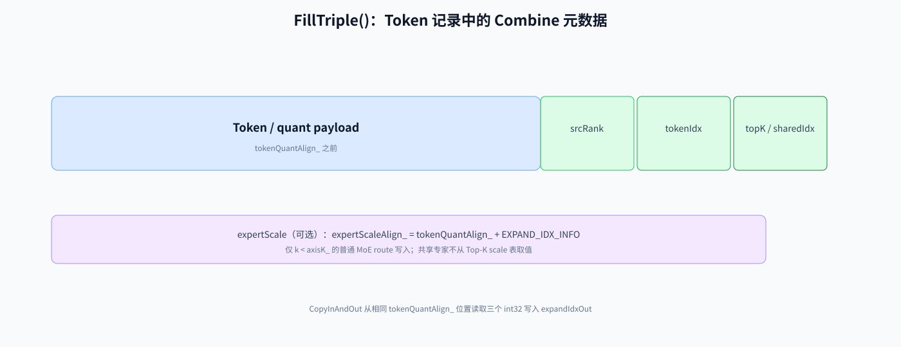

普通 MoE route 的 `k < axisK_`，所以可附带 `expertScales[token*K+k]`；共享专家的 `k >= axisK_`，不会从这张 Top-K scale 表取值。

## 4. `LocalWindowCopy()`：等待 payload 并生成连续输出

### 4.0 Reset 与重新分配 UB

`LocalWindowCopy()` 由所有 AIV 执行。开头 `tpipe_->Reset()` 释放前置支路的 UB 配置，所以 `Process()` 必须先做 `PipeBarrier<PIPE_ALL>()`。

真实的重置、同步缓冲申请和全 AIV 分核代码是：

```cpp
tpipe_->Reset();
uint32_t rscvNumAlign =
    Ceil(rscvStatusNum_ * sizeof(int32_t), UB_ALIGN) * UB_ALIGN;
tpipe_->InitBuffer(scalarBuf_, UB_ALIGN);
tpipe_->InitBuffer(statusWaitBuf, aivUsedCumSum_ * UB_ALIGN);
tpipe_->InitBuffer(cumSumBuf, rscvNumAlign);
tpipe_->InitBuffer(statusCleanBuf, aivUsedCumSum_ * UB_ALIGN);
statusFp32Tensor_ = statusWaitBuf.Get<float>();
statusCleanFp32Tensor_ = statusCleanBuf.Get<float>();
sendCntTensor_ = cumSumBuf.Get<int32_t>();
SplitToCore(rscvStatusNum_, aivNum_, startId_, endId_, sendNum_, true);
WaitCumSumFlag();
HXTimeIt(3);
if (sendNum_ == 0) {
    return;
}
```

连续化缓冲的大小不是固定写死为 190 KiB，而是从 `FULL_MESH_MAX_UB_SIZE` 扣除已经申请的同步区、三张状态流表、比较 mask 和 flag 清理区：

```cpp
uint32_t expInfoSize = Ceil(sendNum_ * sizeof(uint32_t), UB_ALIGN) * UB_ALIGN;
tpipe_->InitBuffer(expertMapBuf, expInfoSize);
tpipe_->InitBuffer(expertFinishBuf, expInfoSize);
tpipe_->InitBuffer(expertLeftBuf, expInfoSize);
tpipe_->InitBuffer(flagMaskBuf, BUFFER_NUM * UB_ALIGN);
tpipe_->InitBuffer(cleanUpBuf, blockCntPerToken_ * UB_ALIGN);
tBufRealSize_ = FULL_MESH_MAX_UB_SIZE
    - (UB_ALIGN + rscvNumAlign + 2 * aivUsedCumSum_ * UB_ALIGN)
    - (expInfoSize * 3) - BUFFER_NUM * UB_ALIGN
    - blockCntPerToken_ * UB_ALIGN;
tpipe_->InitBuffer(tBuf, tBufRealSize_);
```

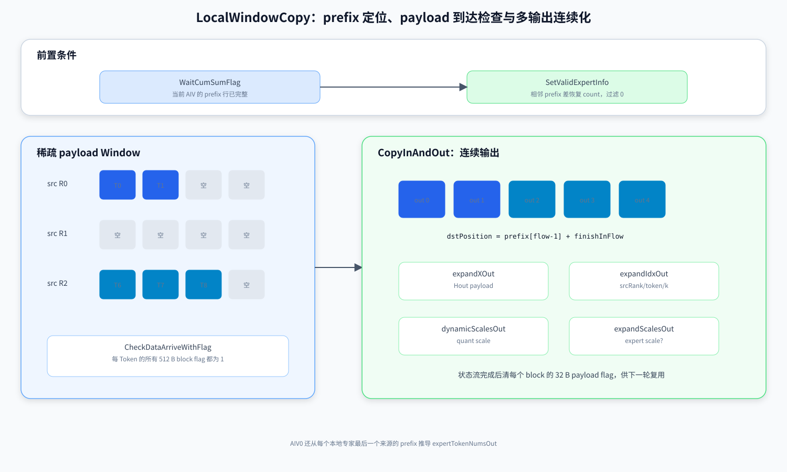

`SplitToCore(rscvStatusNum_, aivNum_, ..., true)` 把所有接收状态流再次分给全部 AIV。这里 `isFront=true`，局部核号就是 `aivId_`。

### 4.1 `WaitCumSumFlag()`：等待本 AIV 的完整 prefix 行

`WaitCumSumFlag()` 读取区域 B 中属于当前 `aivId_` 的一整行。每个完成块由 CumSum 核写入一项整数 1，其余位置在初始化时也是 1；因此对 `N * 8` 个 float/int32 位模式求和，目标为 `N * 8`。

```cpp
int32_t cumSumFlag = 0;
int32_t targetFlag = aivUsedCumSum_ * UB_ALIGN_DATA_COUNT;
uint32_t cumSumFlagOffset =
    (CUMSUM_WS_FLAG_OFFSET + aivId_ * aivUsedCumSum_ * UB_ALIGN) / sizeof(float);
SumParams sumFlagParams{1, aivUsedCumSum_ * UB_ALIGN / sizeof(float),
                        aivUsedCumSum_ * UB_ALIGN_DATA_COUNT};
while (true) {
    DataCopy(statusFp32Tensor_, cumsumWsGMTensor_[cumSumFlagOffset],
             aivUsedCumSum_ * UB_ALIGN_DATA_COUNT);
    SyncFunc<AscendC::HardEvent::MTE2_V>();
    Sum(statusSumOutTensor, statusFp32Tensor_, sumFlagParams);
    SyncFunc<AscendC::HardEvent::V_S>();
    cumSumFlag = statusSumOutTensor.ReinterpretCast<int32_t>().GetValue(0);
    if (cumSumFlag == targetFlag) {
        break;
    }
}
Duplicate<float>(statusCleanFp32Tensor_, 0.0f,
                 aivUsedCumSum_ * UB_ALIGN_DATA_COUNT);
DataCopy(cumsumWsGMTensor_[cumSumFlagOffset], statusCleanFp32Tensor_,
         aivUsedCumSum_ * UB_ALIGN_DATA_COUNT);
```

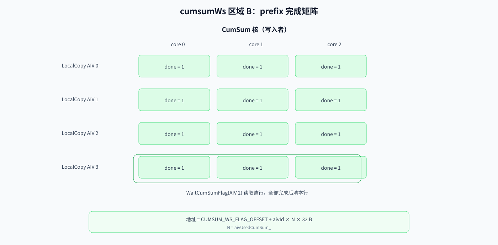

通过后函数把本行全部清零，供下一轮使用。此时只保证 prefix 已写完；payload 仍可能在传输。

### 4.2 `SetValidExpertInfo()`：读取 prefix，恢复每条状态流的 count

`SetValidExpertInfo()` 把 Workspace 中当前 AIV 的完整 prefix 行读到 `sendCntTensor_`：

```cpp
DataCopyPad(sendCntTensor_,
    workspaceGlobal[aivId_ * rscvStatusNum_], scalesCopyInParams, copyPadExtParams);
```

随后只遍历本 AIV 的 `[startId_, endId_)`，用相邻前缀差恢复独立 count，并过滤 count 为 0 的状态流：

```cpp
Duplicate<uint32_t>(expertFinishNumTensor_, 0, expInfoSize / sizeof(uint32_t));
for (uint32_t index = startId_; index < endId_; index++) {
    expertMapTensor_(validNum) = index;
    if (index == 0) {
        expertLeftNumTensor_(validNum) = sendCntTensor_(index);
    } else {
        expertLeftNumTensor_(validNum) =
            sendCntTensor_(index) - sendCntTensor_(index - 1);
    }
    if (expertLeftNumTensor_(validNum) != 0) {
        validNum += 1;
    }
}
```

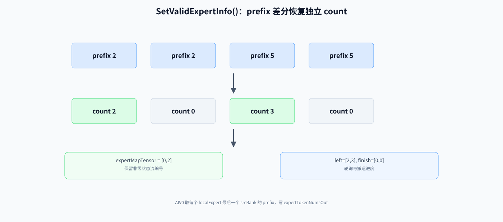

#### 4.2.1 3510 在这里写 `expertTokenNumsOut`

只有 `aivId_ == 0` 执行。对于每个本地专家，函数取该专家最后一个来源 Rank 对应的 prefix。`expertTokenNumsType_ == 0` 时直接写累计结束位置；否则减去上一个专家的末值，写独立数量。

```cpp
if (aivId_ == 0) {
    uint32_t localExpertNum = isShareExpertRankFlag_ ? 1 : moeExpertNumPerRank_;
    int64_t lastVal = 0;
    for (uint32_t localExpertIdx = 0;
         localExpertIdx < localExpertNum; ++localExpertIdx) {
        if (expertTokenNumsType_ == 0) {
            expertTokenNumsLocalTensor(localExpertIdx) =
                int64_t(sendCntTensor_(localExpertIdx * epWorldSize_ + epWorldSize_ - 1));
        } else {
            expertTokenNumsLocalTensor(localExpertIdx) =
                int64_t(sendCntTensor_(localExpertIdx * epWorldSize_ + epWorldSize_ - 1)) - lastVal;
            lastVal = int64_t(sendCntTensor_(localExpertIdx * epWorldSize_ + epWorldSize_ - 1));
        }
    }
    DataCopyPad(expertTokenNumsOutGMTensor_, expertTokenNumsLocalTensor,
                expertTokenNumsCopyParams);
}
```


共享专家 Rank 的 `localExpertNum` 固定为 1；MoE Rank 为 `moeExpertNumPerRank_`。

### 4.3 `WaitAndFormatOutput()`：轮询各状态流

`WaitAndFormatOutput()` 对有效状态流轮询。一次最多处理 `maxCopyTokenCnt = tBufRealSize_ / hCommuSize_` 个 Token。

`tBuf` 不是单一 Tensor：前半部分先切成 `flagGatherOutTensor_` 和 `flagRecvTensor_`，同一物理区又通过 `xTmpTensor_` 作为 payload 搬入区使用。调用者一次只处在“检查 flag”或“搬 payload”阶段，依赖流水同步保证复用安全。

状态流编号先转换为 payload Window 的来源块：

```cpp
srcDataBlockIdx = srcExpertId % epWorldSize_ * localExpertNum
                + srcExpertId / epWorldSize_;
if (!(isShareExpertRankFlag_ || hasElasticInfoFlag_)) {
    srcDataBlockIdx = (srcExpertId + epRankId_) % epWorldSize_ * localExpertNum
                    + srcExpertId / epWorldSize_;
}
```


这与 3.3.2 的发送地址旋转严格配对。

轮询主体只有在本批 `arriveCount == copyCnt` 时才调用 `CopyInAndOut()`；部分到达不会先搬已到部分，而是切换到下一个有效状态流：

```cpp
arriveCount = CheckDataArriveWithFlag(
    srcDataBlockIdx, expertFinishNumTensor_(index), copyCnt);
if (arriveCount == copyCnt) {
    dstPosition = srcExpertId != 0 ? sendCntTensor_(srcExpertId - 1) : 0;
    dstPosition += expertFinishNumTensor_(index);
    GM_ADDR wAddr = (__gm__ uint8_t *)(windowGM_) + srcDataBlockIdx * expertPerSizeOnWin_;
    CopyInAndOut(xOutInt32Tensor, wAddr, index, dstPosition, arriveCount);
    expertFinishNumTensor_(index) += arriveCount;
    expertLeftNumTensor_(index) -= arriveCount;
} else {
    index = (index + 1) % validNum;
}
```

### 4.4 `CheckDataArriveWithFlag()`：检查每个 512 B 分块的 ready

函数从目标状态流当前 `beginIdx` 个 Token 开始，只搬每个 512 B 分块偏移 480 B 处的第一个 float：

```cpp
wAddr = windowGM_ + srcExpDataIdx * expertPerSizeOnWin_
      + beginIdx * hCommuSize_ + SPLIT_BLOCK_DATA_SIZE;
DataCopyExtParams expFlagCopyParams{
    uint16_t(flagNum), sizeof(float), SPLIT_BLOCK_SIZE - sizeof(float), 0, 0};
```

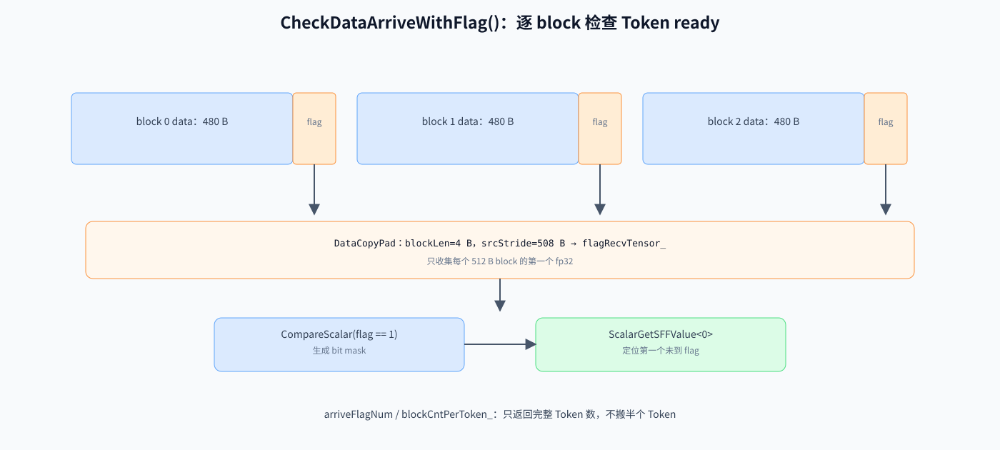

`CompareScalar(..., 1.0f, EQ)` 生成位图，`ScalarGetSFFValue<0>` 找第一个 0。只有一个 Token 的 `blockCntPerToken_` 个 flag 全为 1，该 Token 才计入 `arriveCount`；返回值因此总是完整 Token 数，不会搬半个 Token。

```cpp
GatherMask(flagGatherOutTensor_, flagRecvTensor_, flagRecvGatherMask_, true, 1,
           {1, static_cast<uint16_t>(flagNum), 1, 0}, rsvdCnt);
CompareScalar(flagCompResultU8_, flagGatherOutTensor_, float(1),
              AscendC::CMPMODE::EQ, compareCount);
for (uint32_t i = 0; i < compResultU64Num; i++) {
    uint64_t flagCompMask = flagCompResultLtU64_(i);
    int64_t firstValidIdx = ScalarGetSFFValue<0>(flagCompMask);
    if (firstValidIdx == -1) {
        arriveFlagNum += 64U;
    } else {
        arriveFlagNum += uint32_t(firstValidIdx);
        break;
    }
}
return uint32_t(arriveFlagNum / blockCntPerToken_);
```

### 4.5 `CopyInAndOut()`：去掉 32 B flag 洞并写正式输出

当 `arriveCount == copyCnt` 时，目标连续位置为：

```cpp
dstPosition = srcExpertId != 0 ? sendCntTensor_(srcExpertId - 1) : 0;
dstPosition += expertFinishNumTensor_(index);
```

前一个状态流的 prefix 给出本状态流在连续输出中的起点，`expertFinishNumTensor_` 给出本状态流内已经处理的偏移。

`CopyInAndOut()` 使用 `srcTokenCopyParams` 跨过每块末尾 32 B，把每块前 480 B 紧凑搬入 `xTmpTensor_`，再分别写各正式输出：

```cpp
DataCopyParams srcTokenCopyParams{
    static_cast<uint16_t>(blockCntPerToken_ * arriveCount),
    static_cast<uint16_t>(SPLIT_BLOCK_DATA_SIZE),
    static_cast<uint16_t>(UB_ALIGN), 0};
DataCopyPad(xTmpTensor_,
    dataFlagGlobal[expertFinishNumTensor_(index) * hCommuSize_ / sizeof(XOutType)],
    srcTokenCopyParams, srcTokenPadParams);
SyncFunc<AscendC::HardEvent::MTE2_MTE3>();
quantInst_.CopyScalesToOut(dstPosition, scaleOutBytes_,
                           xTmpTensor_, scalesCopyParams);
DataCopyPad(expandXOutGlobal, xTmpTensor_, tokenCopyParams);
DataCopyPad(expandIdxGMTensor_[dstPosition * EXPAND_IDX_INFO],
            xOutInt32Tensor[tokenQuantAlign_], expandIdxCopyParams);
```

存在 `expertScales` 时还会从 Window 中逐 Token 跨 `hCommuSize_` 读取一个 float，再连续写到 `expandScalesOut`：

```cpp
DataCopyPad(xOutFloatTensor, expertScaleInGlobal,
            expertScaleCopyInParams, expertScalePadParams);
SyncFunc<AscendC::HardEvent::MTE2_MTE3>();
DataCopyPad(expandScalesOutGlobal, xOutFloatTensor,
            expertScaleCopyOutParams);
```

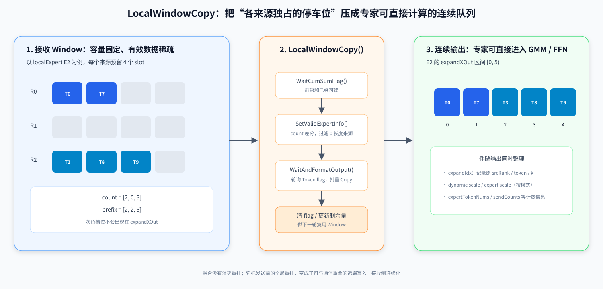

`expandIdx` 的源地址是 `xOutInt32Tensor[tokenQuantAlign_]`，与 `FillTriple()` 的写入位置一致。可选 `expertScale` 因为处在插旗前的紧凑布局中，函数先把其紧凑偏移换算为 Window 的 `480/512` 分块偏移，再单独跨 `hCommuSize_` 收集到 `expandScalesOut`。

### 4.6 消费完成后清 payload flag

当某一状态流的 `expertLeftNumTensor_(index)` 归零，函数遍历该流已经接收的全部 Token，把每个 512 B 分块的 flag 区清零：

```cpp
uint32_t flagIndex = i * SPLIT_BLOCK_COUNT * blockCntPerToken_
                   + SPLIT_BLOCK_DATA_COUNT;
DataCopy(cleanGlobal[flagIndex], cleanUpTensor_, cleanUpParams);
```


这里必须等该状态流全部 Token 都已搬完才清理。若提前清理，轮询会把已经到达的数据误判为未到达；若不清理，下一轮会把旧 flag 误判为新数据。

## 5. 同步、打点与当前源码中的实验写回

### 5.1 流水同步的含义

- `MTE2_*`：保护 GM/Window 到 UB 的读与后续 Vector/Scalar 使用；
- `*_MTE3`：保护 UB 数据准备完成后再写 GM/远端 Window；
- 发送循环的 8 组 event：保护 `outBuf` 环形 slot 不被提前复用；
- `cumsumWsGMTensor_` 两块矩阵：跨 AIV 的软同步；
- `SyncAll<true>()`：所有 AIV 完成本轮 `LocalWindowCopy()` 后再结束。

### 5.2 `RunPosRecord()` 与 `HXTimeIt()`

`RunPosRecord()` 把阶段编号写到 `selfDataStatusGMTensor_[1]`：

```cpp
dataStateLocalTensor_ = runPosBuf.Get<uint32_t>();
dataStateLocalTensor_.SetValue(0, runPos);
SyncFunc<AscendC::HardEvent::S_MTE3>();
DataCopyPad(selfDataStatusGMTensor_[1],
            dataStateLocalTensor_, dataStateParams_);
```

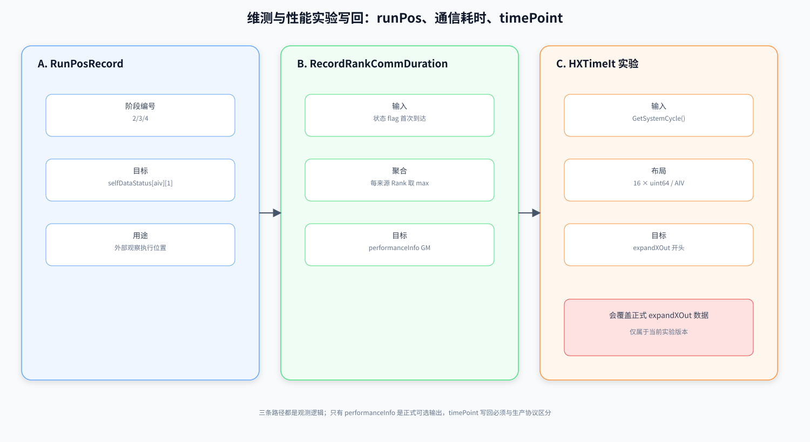

`HXTimeIt()` 记录本 AIV 的系统 cycle。当前 `Process()` 在末尾把 `timePoint_[0..15]` 写到 `expandXOutGM_` 开头：

```cpp
timePointGlobal.SetGlobalBuffer((__gm__ uint64_t *)(expandXOutGM_));
timePointGlobal.SetValue(aivId_ * 16 + i, timePoint_[i]);
```


这是该固定源码快照中的性能实验写回，会覆盖正式 `expandXOut` 开头的数据，不是 Dispatch 输出协议本身。分析功能正确性或移植到生产实现时，必须把它与 `CopyInAndOut()` 生成的正式输出区分开。

## 6. 3510 主调用链索引

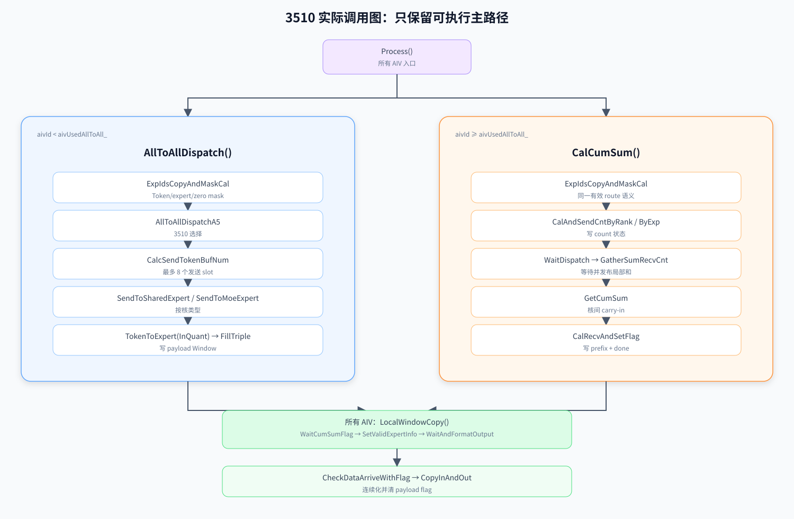

3510 主线不调用 `AllToAllDispatchA3()`、`SendToMoeExpertByBS()`、`CalcBSTokenRange()`、`SendBSExpertLoop()`、`CalExpertSendNum()`、`SplitExpertNumToCore()` 和 `SetExpertTokenNums()`。其中 `CalExpertSendNum()`、`SplitExpertNumToCore()` 位于 `SendToMoeExpert()` 的非 3510 分支。阅读或调优时，不应把这些函数的行为并入 3510 实际执行路径。

## 7. 对外 Tensor 与 Window 通信格式补充

### 7.1 输入 `x` 是隐状态，不是 Token ID

对外接口中的 `x` 是形状为 `[BS,H]` 的二维 Tensor。`BS` 是当前 Rank 的 Token 数，`H` 是每个 Token 的 hidden size；`x[i,j]` 表示第 `i` 个 Token 的第 `j` 个隐藏特征。Kernel 以 `xGMTensor_[srcTokenIndex * copyInAxisH_]` 为起点读取一整行。数据类型由量化模式和平台决定，可以是 BF16、FP16、FP8、HIFLOAT8 或 FP4 等。

### 7.2 对外输出与内部通信记录不是同一种布局

- `expandXOut[A,H]`：当前 Rank 本地专家最终收到的连续 Token 特征；
- `dynamicScalesOut`：量化场景的逐 Token scale；
- `assistInfoForCombineOut`：供 Combine 恢复来源的 `(srcRank,tokenIndex,topKIndex)` 三元组流；
- `expertTokenNumsOut[localExpertNum]`：各本地专家的 Token 数或前缀和；
- `epRecvCountsOut`：各来源 Rank/专家状态流的接收计数或前缀信息。

Window 中的单 Token 记录还包含对齐、元数据和 ready flag，不能把它的物理跨度直接当成 `expandXOut` 的行宽。`LocalWindowCopy()` 会移除通信格式中的 flag 洞，将 payload、scale 和三元组分别写入连续的对外输出。

### 7.3 480 B payload 与 32 B flag

3510 路径将一条通信记录按 512 B 分块。每块前 480 B 保存有效数据，后 32 B 保存到达标志，因此：

```text
SPLIT_BLOCK_SIZE      = 512 B
SPLIT_BLOCK_DATA_SIZE = 480 B
UB_ALIGN              = 32 B
```

`FillTriple()` 写入来源 Rank、原 Token 下标和 Top-K 下标；量化场景还可能携带动态 scale 或 expert scale。发送端在写出 payload 前完成这些元数据的填充，接收端则按相同的 `tokenQuantAlign_` 偏移拆出三元组。若只按 `H * sizeof(dtype)` 理解一条 Window 记录，会漏掉对齐、scale、三元组和每个 512 B 分块末尾的 flag。

### 7.4 共享专家 Rank 与普通 MoE Rank

共享专家是否存在由 `sharedExpertRankNum_` 等 tiling 字段决定。共享专家发送和普通 MoE 专家发送使用不同的窗口区域与目标 Rank 计算：共享专家按共享专家 Rank 遍历，普通专家根据全局专家 ID 换算目标 Rank 和本地专家下标。弹性缩容场景还要经过 `elasticInfoTensor_` 将逻辑 Rank 映射到物理 Rank。

3510 非弹性普通 MoE 路径使用旋转后的来源槽位：

```cpp
srcRankSlot = (epRankId_ + toRankId) % epWorldSize_;
```

因此 payload Window 的来源槽位不能简单理解为恒等的 `epRankId_`。状态 Window 的轴顺序、payload Window 的来源槽位和目标专家本地下标应分别追踪。

## 8. 接收模型与数据搬运原语补充

### 8.1 没有与发送一一配对的显式 `Recv()`

Full Mesh V2 不是 `Send()`/`Recv()` 成对调用的模型。发送 Rank 通过：

```cpp
DataCopy(dstWinGMTensor, localTensor, axisHCommu_);
```

直接写入目标 Rank 的 HCCL Window。接收 Rank 随后在 `LocalWindowCopy()` 中轮询本地 Window：

```text
LocalWindowCopy()
  -> WaitCumSumFlag()
  -> SetValidExpertInfo()
  -> WaitAndFormatOutput()
       -> CheckDataArriveWithFlag()
       -> CopyInAndOut()
```

`WaitCumSumFlag()` 等待的是计数前缀完成，`CheckDataArriveWithFlag()` 等待的是 payload 到达。两类 flag 的 writer、reader、存储区域和完成条件不同，不能合并为同一个“通信完成”状态。

### 8.2 `Copy`、`DataCopy` 与 `DataCopyPad`

- `Copy(...)`：通常表示 LocalTensor 之间的片上复制或向量侧数据整理，不承担跨 Rank Window 通信；
- `DataCopy(dstWinGMTensor,localTensor,axisHCommu_)`：由 MTE3 将已经排好通信格式的 UB 数据写入目标 Rank Window；
- `DataCopyPad(xInTensor,xGMTensor_[...],...)`：由 MTE2 从输入 GM 搬入单个 Token，并处理源 stride 和尾部补齐；
- `DataCopyPad(xTmpTensor_,window,srcTokenCopyParams,...)`：按多 block 搬入 Window 数据，通过 `srcStride=32 B` 跳过每个 480 B payload 后的 flag；
- `DataCopyPad(expandXOutGlobal,xTmpTensor_,...)`：把去除 flag 洞后的连续 payload 写入正式输出。

这里的 `DataCopyPad` 不只是“带补零的 memcpy”。它的 `blockCount`、`blockLen`、`srcStride` 和 `dstStride` 共同描述二维分块搬运。分析一次搬运的真实读写范围时，应先把四个参数展开成逐 block 地址，再判断 32 B flag、尾块 padding 和 Token 间距是否被正确跨过。

### 8.3 `GatherSumRecvCnt()` 的数据方向

每个 CumSum 核先从自己负责的状态块提取 `tokenCnt`，计算本核局部和，再把局部和发布到 `cumsumWsGMTensor_` 的对应行。`GetCumSum()` 按列等待所有发布者，并累加当前核之前的局部和作为 carry-in；`CalRecvAndSetFlag()` 再在本核区间内生成 inclusive prefix。

因此它不是单纯的“把收到的 count 求和”，而是以下核间数据流的一部分：

```text
状态 Window
  -> 本核状态区间的 tokenCnt
  -> 本核局部和
  -> Workspace 局部和矩阵
  -> 跨核 carry-in
  -> 本核 inclusive prefix
  -> sendCountsOut / 每个 LocalWindowCopy AIV 的 Workspace 行
```

只有对应 CumSum 核写完某个 AIV 所需的 prefix 分片后，才会发布该分片的完成 flag；`LocalWindowCopy()` 要等自己这一行的所有分片完成，而不是只等待一个总计数。
