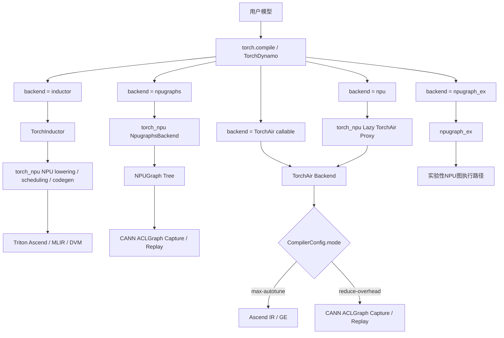
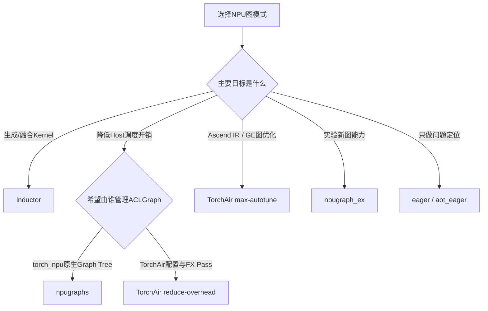

# torch_npu 图模式后端介绍

## 1. 为什么容易混淆

在 Ascend PyTorch 软件栈中，“backend”至少可能指三层不同概念：

1. `torch.compile(..., backend=...)` 接收的 **TorchDynamo backend**；
2. TorchAir `CompilerConfig.mode` 选择的 **图执行模式**；
3. TorchInductor 面向 NPU 时使用的 **内部 codegen backend**。

例如，下面三项并不处于同一级：

```text
backend="inductor"             # TorchDynamo backend
mode="reduce-overhead"         # TorchAir执行模式
TORCHINDUCTOR_NPU_BACKEND=dvm   # Inductor内部NPU codegen选择
```

理解 torch_npu 图模式时，应先确定讨论的是哪一层。

---

## 2. 软件栈分层



各组件的职责如下：

| 组件 | 主要职责 |
|---|---|
| PyTorch | 提供 `torch.compile`、TorchDynamo、AOTAutograd、TorchInductor及调试backend |
| torch_npu | 注册NPU设备能力、NPU Inductor实现、`npugraphs`、`npu`代理及`npugraph_ex` |
| TorchAir | 提供Ascend NPU图编译backend，以及Ascend IR和ACLGraph执行模式 |
| CANN | 提供GE、ACL Runtime、ACLGraph、ACLNN、算子编译及Device执行能力 |

---

## 3. Backend总览

当前 torch_npu 文档公开列出的NPU `torch.compile` backend是`inductor`和`npugraphs`，默认值为`inductor`。对应说明位于：

```text
torch_npu/_inductor/docs/torch_compile_api/torch_compile_api.md
```

源码中还注册了`npu`和`npugraph_ex`。完整关系如下：

| `torch.compile`写法 | 谁注册/提供 | 实际路径 | 定位 |
|---|---|---|---|
| `backend="inductor"` | PyTorch注册；torch_npu补充NPU实现 | TorchInductor → NPU codegen | 公开支持的编译路径 |
| `backend="npugraphs"` | torch_npu | AOTAutograd → NPUGraph Tree → ACLGraph | 公开支持的图捕获路径 |
| `backend="npu"` | torch_npu注册名字；TorchAir提供实际backend | TorchAir → Ascend IR或ACLGraph | 依赖torch_npu是否包含TorchAir |
| `backend=torchair.get_npu_backend(...)` | TorchAir直接返回callable | TorchAir → Ascend IR或ACLGraph | 显式、可配置的TorchAir路径 |
| `backend="npugraph_ex"` | torch_npu注册 | npugraph_ex | 已有源码和测试，偏实验性 |
| `backend="eager"`、`"aot_eager"` | PyTorch | 抓图后仍以eager方式运行 | 调试和问题定界 |

---

## 4. backend="inductor"

### 4.1 提供方

`inductor`是PyTorch原生TorchDynamo backend。torch_npu不是重新注册一个同名backend，而是为TorchInductor补充NPU设备实现，包括：

- NPU DeviceInterface；
- NPU lowering和decomposition；
- NPU scheduling；
- wrapper/codegen；
- Triton Ascend、MLIR和DVM等内部实现。

NPU codegen注册位置：

```text
torch_npu/_inductor/__init__.py
```

核心注册逻辑：

```python
register_backend_for_device(
    "npu",
    NPUCombinedScheduling,
    NPUWrapperCodeGen,
    CppWrapperNpu,
)
```

### 4.2 调用方式

```python
import torch
import torch_npu

compiled_model = torch.compile(
    model,
    backend="inductor",
    fullgraph=True,
    dynamic=False,
)
```

### 4.3 内部NPU codegen选择

当前源码包含以下内部loader：

```text
torch_npu/_inductor/__init__.py
```

```python
_BACKEND_LOADERS = {
    "mlir": _load_mlir_backend,
    "dvm": _load_dvm_backend,
    "default": _load_triton_backend,
}
```

可以通过环境变量选择：

```bash
export TORCHINDUCTOR_NPU_BACKEND=default  # Triton Ascend路径
export TORCHINDUCTOR_NPU_BACKEND=mlir
export TORCHINDUCTOR_NPU_BACKEND=dvm
```

这里的`default`、`mlir`、`dvm`是Inductor内部NPU codegen选择，不是直接传给`torch.compile(backend=...)`的Dynamo backend名称。外层仍然是：

```python
torch.compile(model, backend="inductor")
```

### 4.4 适用场景

- 希望进行算子融合或生成新Kernel；
- 网络中的算子具有对应lowering，或者允许受控fallback；
- 可以接受首次编译开销；
- 需要训练前后向编译，或希望利用Inductor优化能力。

---

## 5. backend="npugraphs"

### 5.1 提供方

`npugraphs`由torch_npu注册和实现，不是TorchAir backend。

实现与注册位置：

```text
torch_npu/utils/_graph_tree.py
```

### 5.2 执行链

```text
TorchDynamo
  → AOTAutograd
  → torch_npu NpugraphsBackend
  → torch_npu NPUGraph Tree
  → torch.npu.NPUGraph
  → CANN ACLGraph Capture / Replay
```

它的核心目标不是生成新的融合Kernel，而是捕获一段已经能够在NPU上运行的任务序列，并在后续调用中直接replay，以降低Host逐算子下发开销。

### 5.3 调用方式

```python
compiled_model = torch.compile(
    model,
    backend="npugraphs",
    fullgraph=True,
    dynamic=False,
)
```

### 5.4 适用场景

- 在线推理；
- 输入shape较稳定；
- 网络本身已经可以正常eager执行；
- 性能瓶颈主要来自Host调度和逐算子下发；
- 不依赖TorchAir GE Converter。

### 5.5 主要约束

- 动态控制流、CPU节点、多设备混合等可能导致跳过捕获；
- 输入mutation需要满足NPUGraph规则；
- 输出Tensor可能在后续replay中被覆盖；
- 不同shape可能产生不同捕获图或触发重新捕获；
- 捕获成功不代表发生了算子融合。

---

## 6. backend="npu"

### 6.1 提供关系

`npu`这个名字由torch_npu注册，但正常情况下实际执行的是TorchAir backend。

注册和延迟加载位置：

```text
torch_npu/dynamo/__init__.py
```

执行链：

```text
backend="npu"
  → torch_npu注册的lazy backend
  → torchair.get_npu_backend()
  → TorchAir
```

### 6.2 调用方式

```python
compiled_model = torch.compile(
    model,
    backend="npu",
    fullgraph=True,
    dynamic=False,
)
```

### 6.3 TorchAir缺失时的行为

如果torch_npu构建产物中没有内嵌TorchAir目录，`backend="npu"`会注册eager实现并打印告警。此时代码可能仍能运行，但没有发生预期的TorchAir图编译。

因此，不能只根据“`backend="npu"`运行成功”判断TorchAir已经生效。应进一步检查：

```python
import torch
import torch_npu
import torchair

print(torchair)
print(torch._dynamo.list_backends())
```

源代码构建时还应确认TorchAir子模块和最终wheel内容，而不是只检查源码目录。

---

## 7. 显式TorchAir callable backend

相比`backend="npu"`，显式调用`torchair.get_npu_backend()`可以传入完整的`CompilerConfig`：

```python
import torch
import torch_npu
import torchair

compiler_config = torchair.CompilerConfig()
npu_backend = torchair.get_npu_backend(
    compiler_config=compiler_config
)

compiled_model = torch.compile(
    model,
    backend=npu_backend,
    fullgraph=True,
    dynamic=False,
)
```

这里传给`torch.compile`的不是backend名称字符串，而是TorchAir返回的callable。

### 7.1 max-autotune：Ascend IR模式

TorchAir默认模式为`max-autotune`，主要路径是：

```text
TorchDynamo FX Graph
  → TorchAir Converter
  → Ascend IR / GE Graph
  → 图优化、编译和执行
```

特点：

- 具备图级优化和一定程度的算子融合能力；
- 算子通常需要注册到Ascend IR计算图；
- 自定义算子通常需要对应GE Converter；
- 与ACLGraph Capture/Replay不是同一执行模式。

### 7.2 reduce-overhead：ACLGraph模式

```python
compiler_config = torchair.CompilerConfig()
compiler_config.mode = "reduce-overhead"

npu_backend = torchair.get_npu_backend(
    compiler_config=compiler_config
)
```

执行链：

```text
TorchDynamo FX Graph
  → TorchAir FX处理
  → 运行单算子任务
  → CANN ACLGraph Capture
  → 后续Replay
```

特点：

- 目标是降低Host调度开销；
- 不要求每个算子提供Ascend IR/GE Converter；
- 暂不以图融合为主要能力；
- 主要适用于在线推理和相对稳定的shape；
- 底层同样使用ACLGraph，但它不是`backend="npugraphs"`这条torch_npu backend路径。

官方说明：

- [reduce-overhead模式配置](https://www.hiascend.com/document/detail/zh/Pytorch/730/modthirdparty/torchairuseguide/torchair_00021.html)
- [TorchAir图模式简介](https://www.hiascend.com/document/detail/zh/Pytorch/730/modthirdparty/torchairuseguide/torchair_00004.html)

### 7.3 ACLNN静态Shape Kernel

在`reduce-overhead`模式下还可以开启：

```python
compiler_config.experimental_config.aclgraph._aclnn_static_shape_kernel = True
compiler_config.experimental_config.aclgraph._aclnn_static_shape_kernel_build_dir = "./static_kernel"
```

这不是新的`torch.compile` backend，而是ACLGraph模式中的算子级优化开关：

- 对支持的ACLNN算子预编译静态Shape Kernel；
- 将部分shape和标量处理前移到编译阶段；
- 减少运行时处理开销；
- 不保证图中每个算子都能生成静态Kernel；
- 是否生效应检查构建目录中的JSON、`.run`产物及运行日志。

官方说明：

- [静态Kernel编译配置](https://www.hiascend.com/document/detail/zh/Pytorch/720/modthirdparty/torchairuseguide/torchair_00020.html)

---

## 8. backend="npugraph_ex"

### 8.1 提供方

`npugraph_ex`由torch_npu注册，并延迟加载对应实现：

```text
torch_npu/dynamo/__init__.py
```

测试中存在直接用法：

```text
test/dynamo/test_npugraph_ex.py
```

```python
compiled_model = torch.compile(
    model,
    backend="npugraph_ex",
    options={"clone_input": False},
    fullgraph=True,
    dynamic=False,
)
```

### 8.2 定位

- 已有源码注册和测试覆盖；
- 当前公开`torch.compile`文档只列出`inductor`和`npugraphs`；
- 更适合作为专项、实验或新能力验证路径；
- 不应仅因为名称包含“npugraph”就与`npugraphs`视为同一实现。

---

## 9. PyTorch调试backend

PyTorch还提供多种调试或验证backend，例如：

```python
torch.compile(model, backend="eager")
torch.compile(model, backend="aot_eager")
```

它们的用途主要是问题定界：

| backend | 用途 |
|---|---|
| `eager` | 验证TorchDynamo抓图、graph break和Guard，不做性能编译 |
| `aot_eager` | 增加AOTAutograd阶段，用于定位前后向图问题 |
| `aot_ts` | 走AOTAutograd和TorchScript相关路径，偏测试/验证 |

这些backend能被`torch.compile`接受，不代表它们是Ascend NPU生产性能后端。

`cudagraphs`则是PyTorch CUDA路径，不能因为名称中有“graphs”就将其视为NPU ACLGraph backend。

---

## 10. 如何查看当前环境实际注册的backend

```python
import torch
import torch_npu

print(torch._dynamo.list_backends())
```

为什么建议显式`import torch_npu`：

- torch_npu需要注册`npu`、`npugraph_ex`等Dynamo backend；
- torch_npu还需要安装针对Dynamo和Inductor的patch；
- 部分wheel可以通过`torch.backends`入口自动加载，但受`TORCH_DEVICE_BACKEND_AUTOLOAD`控制；
- 为了诊断结果明确，显式导入更可靠。

如果结果中只有：

```text
eager
aot_eager
inductor
cudagraphs
...
```

而没有`npu`、`npugraphs`、`npugraph_ex`，应检查：

1. 当前解释器是否安装并成功导入torch_npu；
2. PyTorch与torch_npu版本是否匹配；
3. `TORCH_DEVICE_BACKEND_AUTOLOAD`是否被关闭；
4. torch_npu初始化是否因动态库或环境问题中断；
5. 使用的Python是否与安装wheel的Python一致。

---

## 11. 如何选择



简化建议：

| 需求 | 优先选择 |
|---|---|
| TorchInductor算子融合、生成Kernel | `backend="inductor"` |
| 固定shape推理、降低Host下发开销 | `backend="npugraphs"` |
| 需要TorchAir FX Pass并使用ACLGraph | `get_npu_backend()` + `mode="reduce-overhead"` |
| 需要Ascend IR/GE Converter和图优化 | `get_npu_backend()` + `mode="max-autotune"` |
| 验证Dynamo能否抓图 | `backend="eager"` |
| 验证AOTAutograd前后向图 | `backend="aot_eager"` |
| 验证实验性NPU图功能 | `backend="npugraph_ex"` |

---

## 12. 常见误区

### 误区一：`reduce-overhead`是一个backend名称

不是。它是TorchAir `CompilerConfig.mode`，外层backend仍是TorchAir返回的callable。

### 误区二：`npugraphs`等于TorchAir `reduce-overhead`

不等于。两者都可能落到CANN ACLGraph，但上层编译入口、图管理、FX处理和生命周期管理不同。

### 误区三：开启静态Shape Kernel就是切换backend

不是。它是`reduce-overhead` ACLGraph模式内的算子级优化开关。

### 误区四：`default`、`mlir`、`dvm`可以直接传给`torch.compile(backend=...)`

不能按当前源码这样理解。它们是`backend="inductor"`内部的NPU codegen选择。

### 误区五：`backend="npu"`能运行就代表TorchAir生效

不一定。torch_npu未包含TorchAir时可能注册eager fallback，需要检查实际wheel内容、导入结果和编译日志。

### 误区六：Meta实现等于某个backend已经完整支持该算子

不等于。Meta通常只解决FakeTensor下的shape/dtype传播。完整支持还取决于：

- Inductor是否有lowering或fallback；
- TorchAir Ascend IR模式是否有Converter；
- ACLGraph是否允许捕获该算子的Runtime行为；
- 动态shape、mutation、stream和Host同步是否满足目标backend约束。

---

## 13. 最小验证样例

```python
import torch
import torch_npu


class Model(torch.nn.Module):
    def forward(self, x, y):
        return torch.relu(x + y)


model = Model().npu().eval()
x = torch.randn(32, 128, device="npu")
y = torch.randn(32, 128, device="npu")

print("registered backends:", torch._dynamo.list_backends())

# 方案1：TorchInductor
compiled_inductor = torch.compile(
    model,
    backend="inductor",
    fullgraph=True,
    dynamic=False,
)
out_inductor = compiled_inductor(x, y)

# 方案2：torch_npu NPUGraph Tree
compiled_npugraphs = torch.compile(
    model,
    backend="npugraphs",
    fullgraph=True,
    dynamic=False,
)
out_npugraphs = compiled_npugraphs(x, y)

torch.testing.assert_close(out_inductor, out_npugraphs)
```

TorchAir ACLGraph样例：

```python
import torchair

config = torchair.CompilerConfig()
config.mode = "reduce-overhead"

npu_backend = torchair.get_npu_backend(
    compiler_config=config
)

compiled_torchair_aclgraph = torch.compile(
    model,
    backend=npu_backend,
    fullgraph=True,
    dynamic=False,
)

out_torchair = compiled_torchair_aclgraph(x, y)
torch.testing.assert_close(out_inductor, out_torchair)
```

---

## 14. 证据边界

本文结论来自当前torch_npu源码、仓内文档和昇腾官方TorchAir文档。需要注意：

- backend注册、产品支持范围和实验特性可能随版本变化；
- “源码已注册”不等于当前wheel一定包含对应实现；
- “图成功编译”不等于所有节点都发生了融合或静态Kernel编译；
- 是否真正命中目标路径，应结合编译日志、图dump、Profiler和构建产物确认；
- NPU硬件行为和性能结论必须通过目标环境运行验证。

---

## 15. 参考位置

torch_npu仓库：

```text
torch_npu/_inductor/docs/torch_compile_api/torch_compile_api.md
torch_npu/_inductor/__init__.py
torch_npu/dynamo/__init__.py
torch_npu/utils/_graph_tree.py
torch_npu/npu/graphs.py
test/dynamo/test_npugraph_ex.py
```

官方资料：

- [TorchAir reduce-overhead模式配置](https://www.hiascend.com/document/detail/zh/Pytorch/730/modthirdparty/torchairuseguide/torchair_00021.html)
- [TorchAir静态Kernel编译配置](https://www.hiascend.com/document/detail/zh/Pytorch/720/modthirdparty/torchairuseguide/torchair_00020.html)
- [TorchAir图模式简介](https://www.hiascend.com/document/detail/zh/Pytorch/730/modthirdparty/torchairuseguide/torchair_00004.html)
