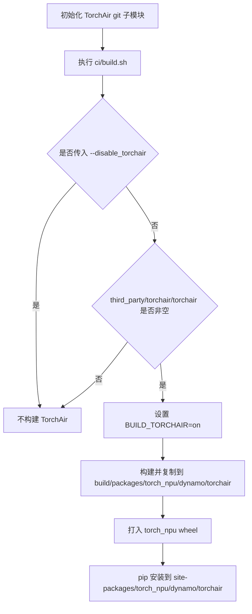
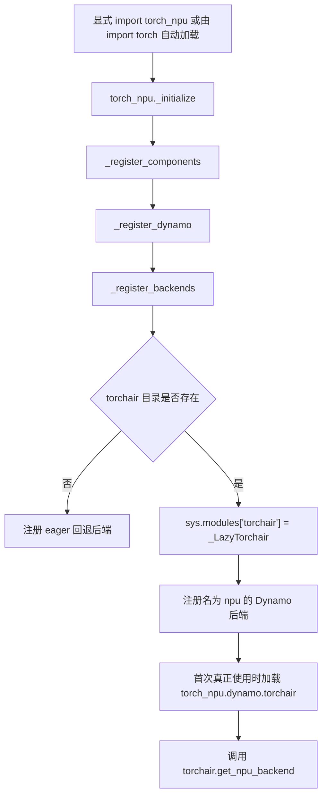

# TorchAir 在 `torch_npu` 中的打包与注册流程

## 1. 文档范围

本文根据 `torch_npu` 及其 TorchAir 集成代码整理，不记录本机路径、代码分支、提交标识或具体软件版本。

这里的“注册”包含两个不同阶段：

1. **构建阶段**：把 TorchAir 放进 `torch_npu` wheel。
2. **Python 运行阶段**：加载 `torch_npu`，注册 Dynamo 后端，并把嵌套模块映射为顶层名称 `torchair`。

## 2. 流程概览

### 2.1 构建（打包）流程



### 2.2 导入与运行时注册流程



## 3. 构建阶段：TorchAir 如何进入 wheel

### 3.1 默认启用，命令行可以禁用

`ci/build.sh` 只有在收到 `--disable_torchair` 时才设置禁用变量：

```bash
--disable_torchair)
    export DISABLE_INSTALL_TORCHAIR=TRUE
```

脚本最终执行：

```bash
python"${PY_VERSION}" setup.py build bdist_wheel
```

`setup.py` 中的默认值为：

```python
DISABLE_TORCHAIR = "FALSE"
```

因此，不传 `--disable_torchair` 只代表“允许构建 TorchAir”，并不保证最终一定包含 TorchAir。

### 3.2 必须存在有效的 TorchAir 子模块

`setup.py` 会检查：

```python
def check_torchair_valid(base_dir):
    torchair_path = os.path.join(base_dir, 'third_party/torchair/torchair')
    return os.path.exists(torchair_path) and (
        os.path.isdir(torchair_path) and len(os.listdir(torchair_path)) != 0
    )
```

也就是说，下面两个条件必须同时成立：

- 未设置 `DISABLE_INSTALL_TORCHAIR=TRUE`；
- `third_party/torchair/torchair` 存在且非空。

如果子模块未初始化，构建会静默跳过 TorchAir，而不是因为缺少 TorchAir 直接失败。

初始化命令：

```bash
git submodule update --init third_party/torchair/torchair
```

### 3.3 TorchAir 的 wheel 内目标路径

条件满足时，`setup.py` 向 CMake 传入：

```python
cmake_args.append('-DBUILD_TORCHAIR=on')
torchair_install_prefix = os.path.join(
    build_type_dir,
    "packages/torch_npu/dynamo/torchair"
)
cmake_args.append(f'-DTORCHAIR_INSTALL_PREFIX={torchair_install_prefix}')
```

CMake 随后执行 TorchAir 的配置和安装脚本：

```cmake
add_custom_target(copy_torchair_pyfiles ALL
    COMMAND export NO_ASCEND_SDK=1 &&
            export TARGET_PYTHON_PATH=${TORCHAIR_TARGET_PYTHON} &&
            cd ${TORCHAIR_BASE} && bash configure
    COMMAND bash ${CMAKE_CURRENT_LIST_DIR}/install.sh ${TORCHAIR_INSTALL_PREFIX}
)
```

最终 TorchAir 被放进：

```text
build/packages/torch_npu/dynamo/torchair/
```

安装 wheel 后对应：

```text
<site-packages>/torch_npu/dynamo/torchair/
```

它不是常规的顶层目录：

```text
<site-packages>/torchair/
```

## 4. `torch_npu` 如何被加载

### 4.1 显式加载

最直接的方式是：

```python
import torch_npu
```

导入 `torch_npu` 会执行包顶层代码，并调用：

```python
_initialize()
```

### 4.2 由 `import torch` 自动加载

wheel 还声明了 PyTorch 后端入口：

```python
'torch.backends': [
    'torch_npu = torch_npu:_autoload',
]
```

当 PyTorch 的设备后端自动加载机制开启时，执行：

```python
import torch
```

可以通过该入口间接导入 `torch_npu`。默认环境变量值按 `1` 处理：

```python
ORG_AUTOLOAD = os.getenv("TORCH_DEVICE_BACKEND_AUTOLOAD", "1")
```

如果启动 Python 前设置：

```bash
export TORCH_DEVICE_BACKEND_AUTOLOAD=0
```

则不能依赖 `import torch` 自动加载，需要显式执行 `import torch_npu`。

注意：真正触发初始化的是导入 `torch_npu` 模块本身；入口函数 `_autoload()` 几乎不做注册工作，它主要恢复自动加载环境变量。模块被导入时，顶层的 `_initialize()` 已经执行。

## 5. `torch_npu` 初始化到 TorchAir 注册的调用链

### 5.1 顶层初始化

`torch_npu/__init__.py`：

```python
def _initialize():
    _load_core_modules()
    _register_components()
    _apply_all_patches()
    _initialize_runtime_lifecycle()
    _enable_optional_features()


_initialize()
```

### 5.2 注册各框架组件

`_register_components()` 按顺序注册 NPU、分布式、Dynamo、RPC 等组件：

```python
def _register_components():
    ...
    _register_npu_backend()
    _register_distributed()
    _register_dynamo()
    _register_rpc()
    _register_default_gradient_device_type()
```

### 5.3 进入 Dynamo 后端注册

`_register_dynamo()` 调用 `register_dynamo_backends()`，后者继续调用：

```python
from torch_npu.dynamo import _register_backends
_register_backends()
```

### 5.4 检查 TorchAir 并注册顶层模块名

`_register_backends()` 首先获得默认 NPU 后端：

```python
def _register_backends():
    global_backend = _get_default_backend(name="npu")
    ...
    _register_npu_backend(global_backend)
```

`_get_default_backend()` 检查当前文件旁边是否存在 `torchair` 目录：

```python
def _get_default_backend(name):
    if not os.path.exists(os.path.join(os.path.dirname(__file__), 'torchair')):
        ...
        return _eager_npu_backend

    global _global_backend_name
    _global_backend_name = name
    sys.modules['torchair'] = _LazyTorchair('torchair')
    return _lazy_exec
```

关键语句是：

```python
sys.modules['torchair'] = _LazyTorchair('torchair')
```

它把字符串键 `torchair` 映射到一个代理对象。因此后续执行：

```python
import torchair
```

时，Python 会先在 `sys.modules` 中找到该对象，而不必在 `site-packages` 根目录查找独立的 `torchair/`。

## 6. 懒加载如何落到真实 TorchAir 模块

代理类 `_LazyTorchair` 位于 `torch_npu/dynamo/__init__.py`。首次需要真实模块时，它执行：

```python
from . import torchair
self._torchair = torchair
return getattr(torchair, name)
```

这里的相对导入 `from . import torchair` 实际加载：

```text
torch_npu.dynamo.torchair
```

对应磁盘目录：

```text
<site-packages>/torch_npu/dynamo/torchair/
```

所以两个名称的关系是：

```text
用户可见名称：torchair
        │
        │ sys.modules 别名与懒加载代理
        ▼
真实嵌套模块：torch_npu.dynamo.torchair
```

## 7. 真正创建 TorchAir Dynamo backend 的时机

注册阶段放入的是 `_lazy_exec`，并不会立即调用 `torchair.get_npu_backend()`：

```python
def _lazy_exec(*args, **kwargs):
    return _get_global_npu_backend(_global_backend_name)(*args, **kwargs)
```

当 Dynamo 第一次真正执行该 backend 时，才进入：

```python
def _get_global_npu_backend(name, config=None):
    ...
    import torchair
    _global_npu_backend[name] = torchair.get_npu_backend(
        compiler_config=config
    )
    return _global_npu_backend[name]
```

创建成功后，backend 被缓存到 `_global_npu_backend`，后续使用同名 backend 时直接复用。

因此可以把流程分成三层懒加载：

1. `import torch` 可能按入口元数据自动加载 `torch_npu`；
2. `torch_npu` 初始化时只向 `sys.modules` 放入 `_LazyTorchair`；
3. Dynamo 第一次实际执行 NPU backend 时才调用 `torchair.get_npu_backend()`。

## 8. 不同场景下的结果

| 场景 | `torch_npu/dynamo/torchair` | `sys.modules['torchair']` | NPU Dynamo backend |
|---|---:|---:|---|
| wheel 未包含 TorchAir | 不存在 | 不注册 | 使用 eager 回退实现 |
| wheel 包含 TorchAir，但尚未加载 `torch_npu` | 存在 | 不存在 | 尚未注册 |
| 已加载 `torch_npu` | 存在 | `_LazyTorchair` | 已注册 `_lazy_exec` |
| 首次实际执行 NPU Dynamo backend 后 | 存在 | 代理已关联真实模块 | `get_npu_backend()` 结果已缓存 |
| 设置 `TORCH_DEVICE_BACKEND_AUTOLOAD=0`，只执行 `import torch` | 存在 | 通常不存在 | 需要显式导入 `torch_npu` |

## 9. 验证方法

### 9.1 验证 wheel 是否包含 TorchAir

```bash
unzip -l dist/torch_npu-*.whl | grep 'torch_npu/dynamo/torchair'
```

没有匹配结果，说明该 wheel 没有携带 TorchAir。

### 9.2 验证安装目录

```bash
python - <<'PY'
from pathlib import Path
import torch_npu

root = Path(torch_npu.__file__).resolve().parent
torchair_dir = root / "dynamo" / "torchair"
print("torch_npu:", root)
print("torchair:", torchair_dir)
print("exists:", torchair_dir.is_dir())
PY
```

### 9.3 验证 `sys.modules` 注册时机

禁用 PyTorch 自动加载后验证最清晰：

```bash
TORCH_DEVICE_BACKEND_AUTOLOAD=0 python - <<'PY'
import sys
import torch

print("import torch 后:", "torchair" in sys.modules)

import torch_npu
print("import torch_npu 后:", "torchair" in sys.modules)

import torchair
print("import torchair 后:", torchair)
PY
```

如果 wheel 包含 TorchAir，预期结果为：

```text
import torch 后: False
import torch_npu 后: True
import torchair 后: <torch_npu.dynamo._LazyTorchair ...>
```

代理对象的具体显示形式可能随实现变化，应以 `sys.modules` 状态、真实目录及 API 调用是否成功为准。

### 9.4 验证实际加载的嵌套模块

```bash
python - <<'PY'
import sys
import torch_npu
import torchair

print("top-level alias:", sys.modules.get("torchair"))
print("nested module:", sys.modules.get("torch_npu.dynamo.torchair"))
PY
```

## 10. 结论

- TorchAir 是作为 `torch_npu` 的嵌套内容打进 wheel 的，目标位置是 `torch_npu/dynamo/torchair`。
- `import torchair` 不是依靠顶层 `site-packages/torchair/`，而是依靠 `torch_npu` 初始化时写入 `sys.modules['torchair']`。
- 必须先让 `torch_npu` 被加载，但不一定必须显式写 `import torch_npu`；默认情况下，`import torch` 可能通过 `torch.backends` 入口自动加载它。
- 禁用 `TORCH_DEVICE_BACKEND_AUTOLOAD` 后，应显式执行 `import torch_npu`。
- `torch_npu` 初始化阶段注册的是懒执行函数；真正的 `torchair.get_npu_backend()` 在第一次使用 NPU Dynamo backend 时调用。
- wheel 没有包含 `torch_npu/dynamo/torchair` 时，不会注册 TorchAir 代理，Dynamo 的 `npu` backend 会退回 eager 实现。
