# 通算融合之 `moe_distribute_dispatch_v2` 分解与调优

## 1. 从 Dense FFN 到 MoE

### 1.1 FFN

Transformer 的一层通常包含两类主要计算：

1. **Attention**：让 Token 之间交换上下文信息（让每个 token 看到其他 token 的信息）；
2. **FFN（Feed-Forward Network）**：让每个 Token 独立经过一组非线性变换（特征抽象）。

可以把一个 Token 想成一句话中某个位置的向量，维度为 `H`。Dense 模型中，所有 Token 都进入同一套 FFN：

```python
# 伪代码：Dense FFN，每个 Token 使用同一组参数
hidden = activation(token × W_up)
output = hidden × W_down
```

扩大 FFN 可以增加模型容量，但同一套大参数会对每个 Token 全量计算。MoE 的思路是：准备多套 FFN，让不同 Token 只使用其中少数几套。（让模型拥有更大的参数容量，但保持接近小模型的推理成本。）

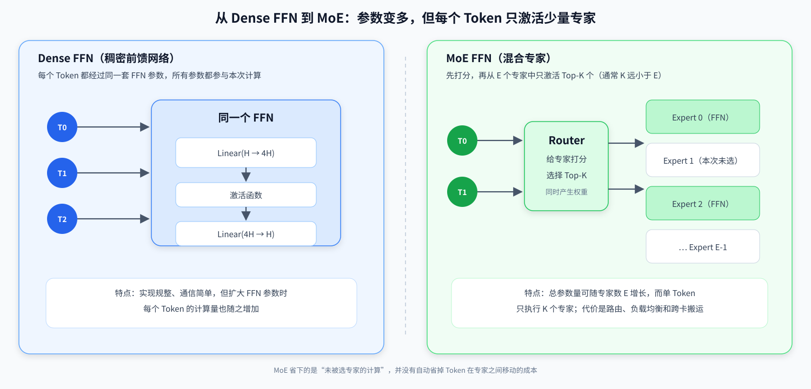

### 1.2 MoE、Expert、Router 和 Top-K

**MoE（Mixture of Experts，混合专家）** 把原来的一套 FFN 替换成 `E` 套 FFN，每套 FFN 就是一个 **Expert**。再增加一个很小的 **Router / Gate**，根据 Token 内容给专家打分，并选择分数最高的 `K` 个专家。

```python
# 伪代码：MoE 的逻辑，不对应某一个具体内核
scores = Router(token)                       # 对 E 个专家打分
expertIds, weights = TopK(scores, K)         # 只选 K 个专家及其权重

result = 0
for k in [0, K):
    expertResult = Expert[expertIds[k]](token)
    result += weights[k] * expertResult      # 合并被选专家的输出
```

关键关系是 `K << E`。模型可以拥有很多专家参数，但一次只激活少量专家，所以它是**参数稀疏激活**，不是“所有专家都算完再挑结果”。

一个最小例子：

| Token | Router 选择 | 本次真正执行的 FFN |
| --- | --- | --- |
| Token `T0` | `E0 × 0.7`、`E2 × 0.3` | E0、E2 |
| Token `T1` | `E3 × 0.8`、`E1 × 0.2` | E3、E1 |
| 未被选中的专家 | 分数较低 | 本次不执行 |

### 1.3 为什么需要 Expert Parallel

**EP（Expert Parallel，专家并行）** 把不同专家放到不同 Rank 上。例如：

| Rank | 本地持有的专家 |
| --- | --- |
| Rank 0 | E0、E1 |
| Rank 1 | E2、E3 |

如果 Rank 0 上的 `T0` 选择了 E0 和 E2，那么：

- 发给 E0 的路由项可留在 Rank 0；
- 发给 E2 的路由项必须跨卡去 Rank 1；
- 两个专家算完后，两个结果还要回到 Rank 0 的 `T0` 位置并加权相加。

---

## 2. Dispatch 与 Combine 到底做什么

### 2.1 一个示例

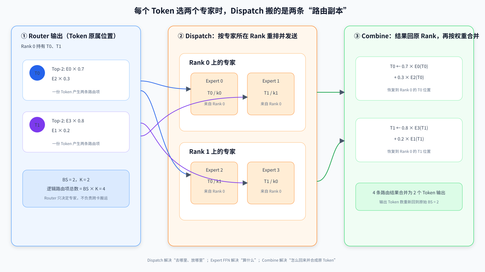

三部分的职责：

- **Router / Gate**：只决定“这个 Token 选哪些专家、权重是多少”；
- **Dispatch**：把每条有效路由项送到专家所在 Rank，并整理成专家可计算的连续布局；
- **Combine**：把专家结果送回 Token 原属 Rank，根据原 Token、`k` 和权重恢复并聚合。

逻辑上，`BS` 个 Token、每个选 `K` 个专家，最多形成 `BS × K` 条路由项；Combine 后又恢复为 `BS` 个 Token。

### 2.2 传统 Dispatch

不同专家收到的 Token 数由 Router 动态决定。假设目标 Rank 上有 E2、E3：

| 来源 | 发给 E2 | 发给 E3 |
| --- | ---: | ---: |
| Rank 0 | 2 | 1 |
| Rank 1 | 0 | 2 |
| Rank 2 | 3 | 0 |

目标 Rank 在接收前不知道每段实际多长。传统做法必须先交换 count，才能得到变长通信的 `recvCounts` 和接收偏移：

```python
# 伪代码：传统 Dispatch 的严格依赖
routeItems = group_by_expert(token, expertIds)  # 先按专家整理本地路由项
sendCounts = count(routeItems)                  # 每个目标 Rank / 专家要发多少
recvCounts = all_to_all(sendCounts)             # 先交换长度
recvOffsets = prefix_sum(recvCounts)            # 长度到齐后才能算落点
received = all_to_all_v(routeItems, recvCounts) # 最后发送变长 Token 数据
```

### 2.3 通算融合流程

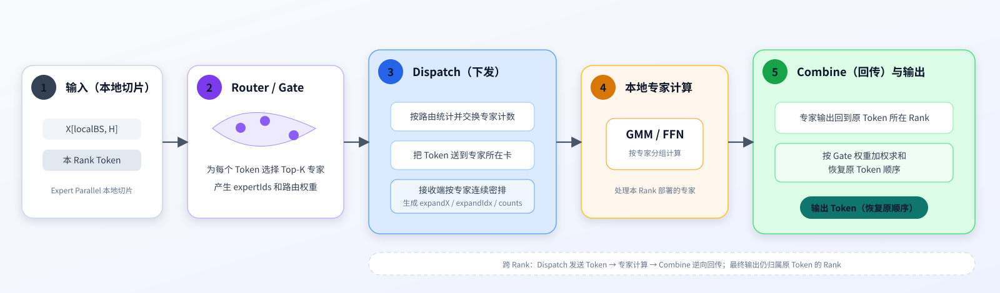

| 阶段 | 典型算子或动作 | 主要产物 |
| --- | --- | --- |
| 路由决策 | Router / Gate | `expertIds[BS,K]`、Top-K 权重 |
| 路由初始化 | `moe_init_routing_v2` | 专家分组、重排索引、计数准备 |
| Dispatch | count 交换 + Token AllToAllV | 本地专家待计算的连续 Token |
| Expert FFN | GMM / FFN | 每条路由项的专家输出 |
| Combine | 结果 AllToAllV + `moe_finalize_routing_v2` | 回到原 Rank 并恢复原 Token 顺序 |

### 2.4 `moe_distribute_dispatch_v2` 的输入输出
| 对象 | 含义 | 说明 |
| --- | --- | --- |
| `x[BS,H]` | 本 Rank 的 Token 特征 | 读取、可选量化后写远端 Window |
| `expertIds[BS,K]` | 每个 Token 选中的专家 | 决定目标 Rank、目标本地专家和 `(token,k)` |
| `xActiveMask`（Python：`x_active_mask`） | 可选 Bool Mask，通常为 `[BS]` 或 `[BS,K]` | `[BS]` 按 Token 屏蔽；`[BS,K]` 按 `(token,k)` 路由项屏蔽 |
| `expandXOut[A,H]` | 按本地专家连续排列的 Token | 直接交给本 Rank 专家 FFN |
| `expertTokenNumsOut[E_local]` | 各本地专家收到多少 Token | 切分专家计算区间 |
| `assistInfoForCombineOut` 等辅助输出 | 原 `srcRank/token/k` 等恢复信息 | 供 Combine 路径把结果送回并复原 |

可选量化 + EP 域 AllToAllV
count 交换、状态同步和接收连续化。

---

## 3. 从朴素 Dispatch 到 full-mesh 通算融合

### 3.1 串行流程

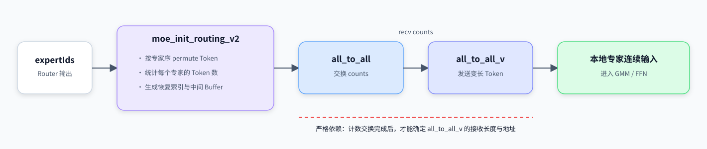

主要开销来自：

- 路由结果和专家重排数据写回 GM，后续算子再次读取；
- alltoall、alltoallv两次通信：每次通信前后都要做一次全局同步；

### 3.2 `Process()`：两组 AIV 并行，最后全部连续化

下面是主线 full-mesh `Process()` 的等价伪代码，保留了真实函数边界并补上语义注释：

```python
# 伪代码：moe_distribute_dispatch_v2_full_mesh.h::Process
if current_core_is_AIV:
    if aivId < aivUsedAllToAll:
        AllToAllDispatch()      # 前一组核：读 Token、量化、写目标 Rank 数据 Window
    else:
        CalCumSum()             # 后一组核：统计/交换 count、计算接收前缀和

    pipe_barrier_all()          # LocalWindowCopy 内部会 reset pipe，先收束本核前序流水
    LocalWindowCopy()           # 所有 AIV：等待 cumsum，再把稀疏槽位压成连续输出
```

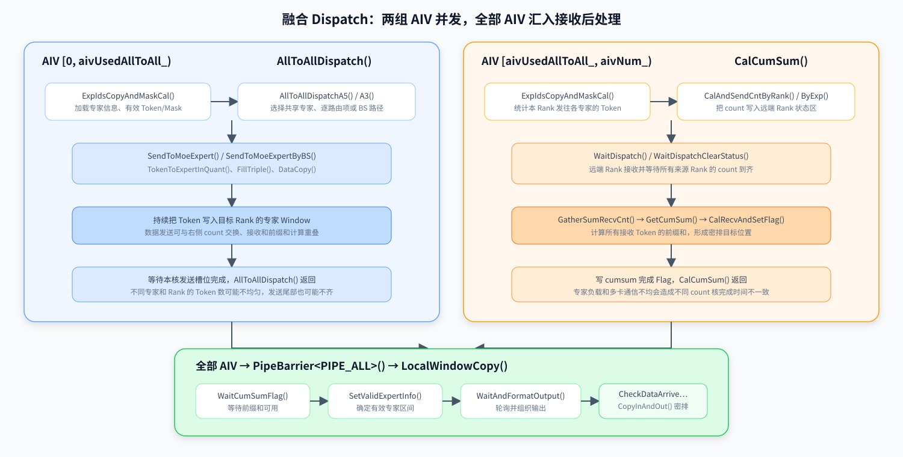

### 3.3 先写独立槽位，后做连续化

full-mesh 不等完整全局前缀和再发送 Token。每个目标 Rank 预先为不同 `srcRank × localExpert` 划出固定容量槽位，发送方只需知道：

1. 目标专家在哪个 Rank；
2. 当前 Token 是本来源发给该专家的第几个；
3. 对应远端 Window 的固定基址。

这样，不同来源可以同时向自己的独立区域写数据，不会互相覆盖。count 也写入另一块状态 Window，通过 Flag 表示“本来源的 count 已就绪”。

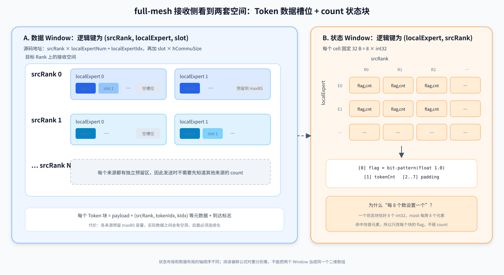

两套布局：

- **数据 Window** 的地址公式包含 `epRankId × localExpertNum + localExpertIdx`，逻辑轴顺序是 `(srcRank, localExpert, slot)`；
- **状态 Window** 的偏移是 `(localExpertIdx × epWorldSize + srcRank) × STATE_OFFSET`，逻辑轴顺序是 `(localExpert, srcRank)`；
- `STATE_OFFSET = 32 B`，一个状态块正好是 8 个 `int32`：`[flag, tokenCnt, padding × 6]`。

状态块初始化里使用掩码“每 8 个元素命中一次”，正是因为每个状态块占 8 个 `int32`。它只把每块第 0 个元素设置为 `0x3F800000`，即 float `1.0` 的位模式，作为 ready flag；第 1 个元素再写 `tokenCnt`。

---

## 4. 源码走读

### 4.1 `CalCumSum()`

#### 4.1.1 生成并发送状态块

先调用 `ExpIdsCopyAndMaskCal()` 得到有效路由，再调用 `CalAndSendCntByExp()` 统计本 Rank 发给目标专家的 Token 数，把 `[flag=1, count]` 写到目标 Rank 的状态 Window。

```python
# 伪代码：每个状态块 32 B；注释对应源码中的 UB_ALIGN_DATA_COUNT = 8
for destination expert assigned to this cumsum core:
    count = number_of_valid_routes_to_this_expert
    statusBlock = [flag_bits_of_float_1, count, 0, 0, 0, 0, 0, 0]
    remote_write(targetRank.status[localExpert, srcRank], statusBlock)
```

#### 4.1.2 接收状态并汇总本核计数

状态块发送后，`SplitToCore()` 将 `rscvStatusNum_` 个状态块按连续区间分给 `aivUsedCumSum_` 个 cumsum 核，余数由前面的核各多处理一个状态块。当前核由此得到半开区间 `[startStatusIndex_, endStatusIndex_)` 和区间长度 `recStatusNumPerCore_`。

`WaitDispatch()` 只等待本核区间内的状态块。它反复读取每个 32 B 状态块的 flag，直到所有 flag 都已置 1；这里表示各来源 Rank 的 count 已写入，不表示 Token payload 已全部处理完成。
全部就绪后，`WaitDispatchClearStatus()` 清零 flag 供下一轮复用，`GatherSumRecvCnt()` 取出各状态块的 `tokenCnt`，求出本核区间的 count 总数，并将“局部总数 + ready flag”发布到 `cumsumWsGMTensor_`。

```python
# 伪代码：每个 cumsum 核只接收并汇总自己的连续区间
start, end = split_contiguous_range(rscvStatusNum, cumsumCoreNum, cumsumCoreId)

while True:
    statusBlocks = load_status_blocks(start, end)
    if all(block.flag == 1 for block in statusBlocks):
        break

clear_flags_for_next_round(statusBlocks)
localCounts = [block.tokenCnt for block in statusBlocks]
publish_core_summary(sum(localCounts), ready=1)
```

`cumsumWsGMTensor_` 不是普通的一维 count 数组，而是从 `recvCntWorkspaceGM_` 尾部对齐后切出的软同步区。它包含两块逻辑矩阵：起始位置是 cumsum 核之间交换“局部总数 + ready”的 `N × N` 矩阵；
`CUMSUM_WS_FLAG_OFFSET`（32 KB=32×32×32B）之后是 cumsum 核向所有 `LocalWindowCopy` AIV 发布完成状态的 `aivNum_ × N` 矩阵，其中 `N = aivUsedCumSum_`。

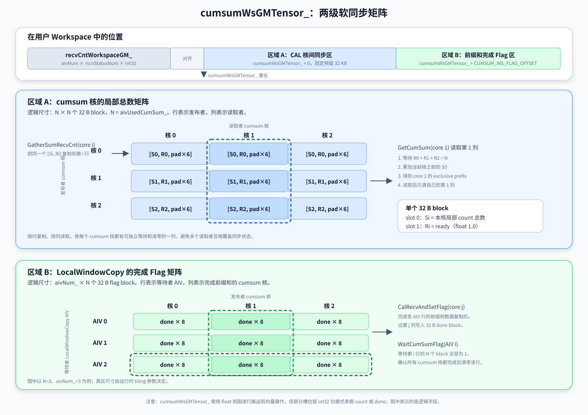

#### 4.1.3 计算并发布全局前缀和

`CalRecvAndSetFlag()` 先调用 `GetCumSum()` 等待所有 cumsum 核发布局部总数，再累加当前核之前各核的局部总数，得到当前区间的 exclusive prefix；第 0 个 cumsum 核的起点为 0。

当前核从这个起点继续累加本核区间内的 `tokenCnt`，生成全局 inclusive prefix 并写入 `sendCountsOutGM_`。同一段结果还会复制到 `recvCntWorkspaceGM_` 的每个 AIV 行，并写入完成 flag。所有 cumsum 核共同补齐每一行，供后续 `LocalWindowCopy()` 独立读取。

```python
# 伪代码：核间 exclusive prefix + 核内 inclusive prefix
wait_until_all_cumsum_cores_ready()
runningCount = sum(coreTotal[0:cumsumCoreId])

for statusIndex in range(start, end):
    runningCount += statusBlocks[statusIndex - start].tokenCnt
    sendCounts[statusIndex] = runningCount

for aivId in range(aivNum): # 复制aivNum行
    recvCntWorkspace[aivId][start:end] = sendCounts[start:end]

for aivId in range(aivNum):
    cumsumDone[aivId][cumsumCoreId] = 1
```

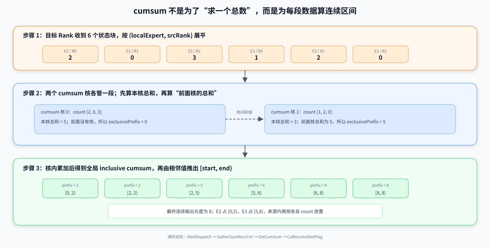

### 4.2 `AllToAllDispatch()`

这条支路做的不是普通 `memcpy`。对每条有效路由项，它至少要完成：

```python
# 伪代码：Token 发送支路的核心语义
load expertIds / mask
find valid (token, k) routes

for each route(tokenIdx, kIdx):
    dstExpert = expertIds[tokenIdx, kIdx]       # 路由结果
    dstRank, localExpert = map(dstExpert)       # 全局专家映射到目标卡和本地专家
    slot = count_previous_same_expert_routes()  # 本来源发给该专家的局部序号

    tokenPayload = load_and_optional_quant(x[tokenIdx])
    metadata = (srcRank, tokenIdx, kIdx)         # Combine 恢复所需三元组
    remote_write(dataWindow[dstRank, srcRank, localExpert, slot],
                 tokenPayload, metadata, readyFlag)
```

其中 `slot` 只依赖“本 Rank 之前有多少路由项发给同一专家”，不依赖其他来源 Rank 的 count，所以 payload 可以与 count/cumsum 支路并行。

源码里的 `CalTokenSendExpertCnt(dstExpertId, calCnt)` 正是在计算这个 `slot`：它只检查展平数组中当前路由项之前的 `calCnt` 个 `expertId`，统计其中有多少个等于 `dstExpertId`。如果把后面的路由项也算进来，当前 Token 的位置就会被未来数据影响，也无法边扫描边发送。

当 `calCnt < axisK` 时，当前路由项还位于第一个 Token 的 Top-K 行内。标准 Top-K 结果在同一 Token 内不会重复选择同一专家，因此它前面不可能已有相同 `dstExpertId`，函数直接返回 0，省掉一次向量比较与归约。这个快捷分支隐含依赖是：**同一行 Top-K 专家 ID 唯一**。

### 4.3 `LocalWindowCopy()`：稀疏槽位变连续专家输入

payload 发送时全局前缀和还没完成，所以接收数据仍散落在不同来源的预留区中。`LocalWindowCopy()` 才把它们组织成 `expandXOut`：


```python
# 伪代码：对应主线 LocalWindowCopy 的真实函数顺序
reset_pipe_and_allocate_buffers()
myStatusRange = SplitToCore(rscvStatusNum, aivNum)

WaitCumSumFlag()                         # 等所有 cumsum 核补齐本 AIV 的前缀和行
if myStatusRange is empty:
    return

validSources = SetValidExpertInfo()      # 相邻前缀差为 count；过滤 count = 0 的来源段
if validSources is empty:
    return

WaitAndFormatOutput(validSources):
    poll each token readyFlag             # count 已到不等于 payload 已全部到
    copy valid token blocks to expandXOut # 依据 prefix 计算连续目标区间
    emit expandIdx / scales / assistInfo
    clear consumed flags                  # Window 可供下一轮复用
```

要区分两个等待：

- `WaitDispatch()` 等的是 **count 状态块**；
- `WaitAndFormatOutput()` 等的是 **Token payload 到达 Flag**。

count 先到只说明“应该收到几个”，不说明这些 Token 数据已经全部落到 Window。

---

## 5. 定位瓶颈：阶段打点与流水图

### 5.1 时间点

实验打点数据链路为：`HXTimeIt(index)` 将 System Cycle 记录到每个 AIV 的 `timePoint_`；算子结束前将其暂写到 `expandXOut`，调用侧将返回 Tensor 保存为 `dispatch_p*.pt`；`autorun.sh` 再调用原始数据解析脚本，把 `.pt` 原始字节转换为 `dispatch_*.csv`，最后由 `result_parser.py` 读取各 AIV 的 `t0...t5` 并生成流水图。

| 时间差 | 性能含义 | 解读注意事项 |
| --- | --- | --- |
| `t5 - t0` | Dispatch 总耗时 | 从初始化入口到 `LocalWindowCopy()` 返回 |
| `t1 - t0` | 发送前处理 | 首 Token 地址、量化或类型转换；cumsum 核没有 `time1` |
| `t2 - t0` | 分支完成时间 | cumsum 核对应计数链路；发送核对应 `AllToAllDispatch()` 返回 |
| `t2 - t1` | 发送核的主要传输段 | 仅对有 `time1` 的发送核有直观意义 |
| `t3 - t2` | 进入后处理后的 cumsum 对齐等待 | `time3` 位于 `WaitCumSumFlag()` 之后；`WaitDispatch()` 本身早在 `CalCumSum()` 内 |
| `t5 - t3` | `LocalWindowCopy()` 后处理 | 包含 Token 到达等待和连续化搬出 |
| `t4 - t3` | LastToken / 末批处理观察量 | `time4` 可能多次覆盖，最终值代表最后一次记录位置 |

### 5.2 流水图

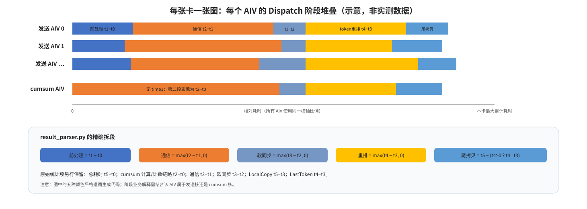

| 观测 | 分析 |
| --- | --- |
| cumsum 组 `max(t2)` 更晚 | count 统计/发送、状态等待或 cumsum 核不足 |
| 发送组 `max(t2)` 更晚 | Token 读入、量化、Window 写或发送核不足 / 慢卡（个别核长尾） |
| `t3 - t2` 大 | 本核通信结束后再等其他核 |
| `t5 - t3` 大 | 最后一批 payload 到达后的拷贝（不可掩盖） |

---

## 6. 三组分核实验：源码差异与取舍

### 6.1 动态 cumsum 核：优化1

#### 主线的问题

主线 full-mesh 在 `__NPU_ARCH__ == 3510` 时先按 `totalExpertNum / 16` 估算 cumsum 核，随后限制为：至少 1、最多总 AIV 的一半、最多 `CUMSUM_MAX_CORE_NUM = 8`、且不超过状态块数量。其他架构分支按 `/32`，上限为 16。

这个估算只随专家数变化，没有感知 `BS × Top-K` 对 Token 发送侧的压力。相同专家数下，小 BS 与大 BS 使用相近的 cumsum 核数，但两条支路的工作量比例可能完全不同。

#### 实验公式

优化1 在 3510 分支引入：

```python
# 伪代码：与优化1的整数公式等价
D = BS * TopK * DATA_TO_CNT_TIME_RATIO  # Token 路由项的加权工作量，ratio = 4
E = totalExpertNum                     # count 侧的工作量近似

allToAllCores = floor(D * aivNum / (D + E))
cumsumCores = aivNum - allToAllCores

# 安全边界：避免任何一侧被吃空，也要满足工作区与状态分片约束
cumsumCores = max(cumsumCores, 1)
cumsumCores = min(cumsumCores, aivNum / 2)
cumsumCores = min(cumsumCores, 32)             # 3510 实验上限；不是主线上限 8
cumsumCores = min(cumsumCores, rscvStatusNum)  # 每核至少负责一个状态块
```

常数 DATA_TO_CNT_TIME_RATIO 会随 `H`、数据类型、量化模式、EP 规模和网络拓扑变化。

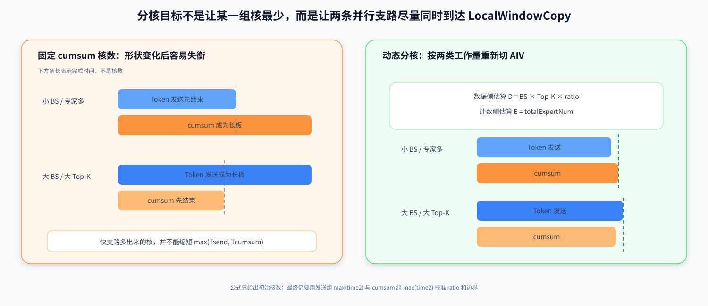

### 6.2 Token 整块优先的 BS 分核：优化2

#### 为什么

普通逐 `(token,k)` 路由项路径可能对同一 Token 重复读入和量化 K 次。如果多个专家共享同一套量化参数，量化结果与 `k` 无关，可以在 UB 中复用：

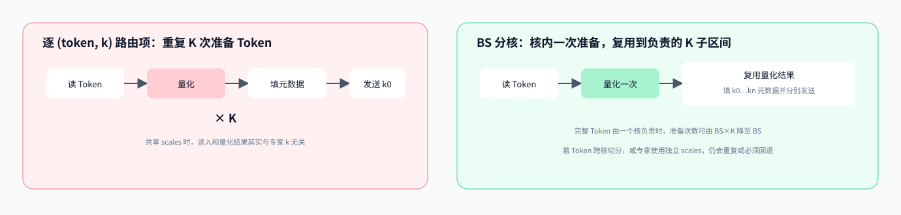

```python
# 伪代码：SendToMoeExpertByBS 的核心复用关系
for token assigned to this AIV:
    tokenLocal = load(x[token])          # 一次 GM → UB
    quantLocal = quant(tokenLocal)       # 一次量化或类型转换

    for k in expert_subset_of_this_AIV:
        fill metadata(srcRank, token, k)
        remote_write(targetExpertWindow, quantLocal, metadata)
```

完整 K 都由同一核处理时，Token 读入和量化次数可从 `BS × K` 接近降到 `BS`。若一个 Token 由多个核协作，每个参与核仍需各量化一次。

#### 两种分核模式

`CalcBSTokenRange()` 按 `activeBS < moeUsedAivNum` 分两种模式：

```python
# 伪代码：Token 整块优先版本
if activeBS < cores:
    coresPerToken = floor(cores / activeBS)     # 多核协作一个 Token
    tokenId = aivId / coresPerToken
    split K nearly evenly among these cores     # 每核只发一段 expert 子集
else:
    tokensPerCore = floor(activeBS / cores)     # 每核拿连续完整 Token
    start = aivId * tokensPerCore
    end = start + tokensPerCore                 # 每个 Token 处理完整 K
```

#### 约束与参数含义

- `activeBS > 16`：Token 太少时，量化复用收益可能不足以抵消分核开销。
- `activeBS % moeUsedAivNum_ == 0 || moeUsedAivNum_ % activeBS == 0`：两者能够整除：保证 Token 与发送核均匀分配。
  - （如果不满足该条件：：BS小的时候会导致大量核空闲，BS大的时候会导致尾Token没有核处理）
- `scalesCount_ <= axisH_`：表示 scales 可跨专家共享，同一 Token 只需量化一次。
- 未启用 expert mask：BS 路径按 Token 的完整 K 组织发送，不处理单条 `(token,k)` 屏蔽。

### 6.3 展平 `BS × Top-K`：优化2_2

优化2_2 把所有路由项统一映射到一维：

`flat = token × TopK + k`

再把 `[0, activeBS × TopK)` 近似均分给所有发送核：

```python
# 伪代码：优化2_2 的 CalcBSTokenRange
totalTasks = activeBS * TopK
base = floor(totalTasks / cores)
remainder = totalTasks % cores

startFlat = aivId * base + min(aivId, remainder)
taskCount = base + (aivId < remainder ? 1 : 0)
endFlat = startFlat + taskCount

startToken, startK = divmod(startFlat, TopK)
endToken, endK = divmod(endFlat, TopK)
# 返回二维半开区间 [(startToken,startK), (endToken,endK))
```

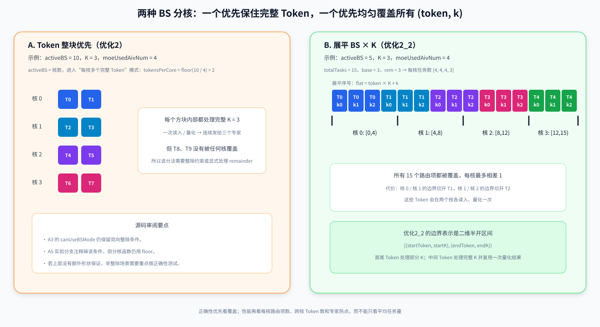

它解决了 Token 整块版本的覆盖限制：

- 每个有效路由项恰好落入一个半开区间；
- 每核任务数最多相差 1；
- 支持 `AIV > BS × K`，多余核得到空区间；
- 如果不能整除：首尾 Token 只处理局部 K，中间 Token 处理完整 K；

`SendBSExpertLoop()` 还有一个与区间正确性相关的变化：只有处理完整 `[0,K)` 时才使用 `(ki + tokenIdx) % K` 的 stagger 顺序；首尾部分 K 区间按线性 `ki` 处理，避免重排后越过当前核的区间边界。

#### 均衡路由项不等于最少量化

一维区间边界可能切开 Token。被切开的 Token 会在相邻两个核各读入、量化一次。

例如 `BS=256、K=6、cores=63`：

- 总任务数 `1536`，每核 24 或 25 项；
- 62 个内部边界中有 20 个没有落在 K 的整数边界；
- Token 处理段数为 `256 + 20 = 276`，即量化次数上界从理想 256 增到 276，但仍远低于逐路由项的 1536。


---

## 附录 A：源码导航

| 想追的问题 | 先看函数或文件 |
| --- | --- |
| full-mesh 总控怎样分两组 AIV | `MoeDistributeDispatchV2FullMesh::Process()` |
| cumsum / AllToAll 核数怎样确定 | `SetTilingDataAndCal()` 中 `aivUsedCumSum_`、`aivUsedAllToAll_` |
| Token 怎样写远端 Window | `AllToAllDispatch()`、`SendToMoeExpert()`、`SendToMoeExpertByBS()` |
| count 状态块怎样初始化和发送 | `CalAndSendCntByRank()`、`CalAndSendCntByExp()` |
| `windowInstatusFp32Tensor_` 怎样等待和清零 | `WaitDispatch()`、`WaitDispatchClearStatus()` |
| 多个 cumsum 核怎样合并前缀 | `GatherSumRecvCnt()`、`GetCumSum()`、`CalRecvAndSetFlag()` |
| 接收 Window 怎样连续化 | `LocalWindowCopy()`、`SetValidExpertInfo()`、`WaitAndFormatOutput()` |
| 状态块大小和常量 | `op_kernel/moe_distribute_v2_constant.h` |
| 算子输入输出和约束 | `moe_distribute_dispatch_v2/README.md` |

## 附录 B：术语速查

| 术语 | 一句话解释 |
| --- | --- |
| Token | Transformer 处理的一个位置对应的特征向量 |
| FFN | 对每个 Token 独立执行的前馈网络 |
| Expert | MoE 中一套独立 FFN 参数 |
| Router / Gate | 为 Token 选择专家并给出权重 |
| Top-K | 每个 Token 实际激活的专家数量 |
| EP Rank | 专家并行通信域中的一张卡 / 一个进程 |
| Route item | 一条 `(token, k) → expert` 映射；一个 Token 可产生多条 |
| Dispatch | Token 按路由去专家所在 Rank，并按专家连续化 |
| Combine | 专家结果回到 Token 原属 Rank，恢复顺序并加权聚合 |
| Window | 可被本 Rank 或远端 Rank 按约定地址读写的通信空间 |
| Flag | 表示 count 或 payload 是否已经写完的状态字段 |
| cumsum | 对变长 count 求前缀和，得到每段连续输出的起止位置 |
| AIV | 本文 full-mesh 内核中承担向量计算、状态处理和数据搬运的核 |
